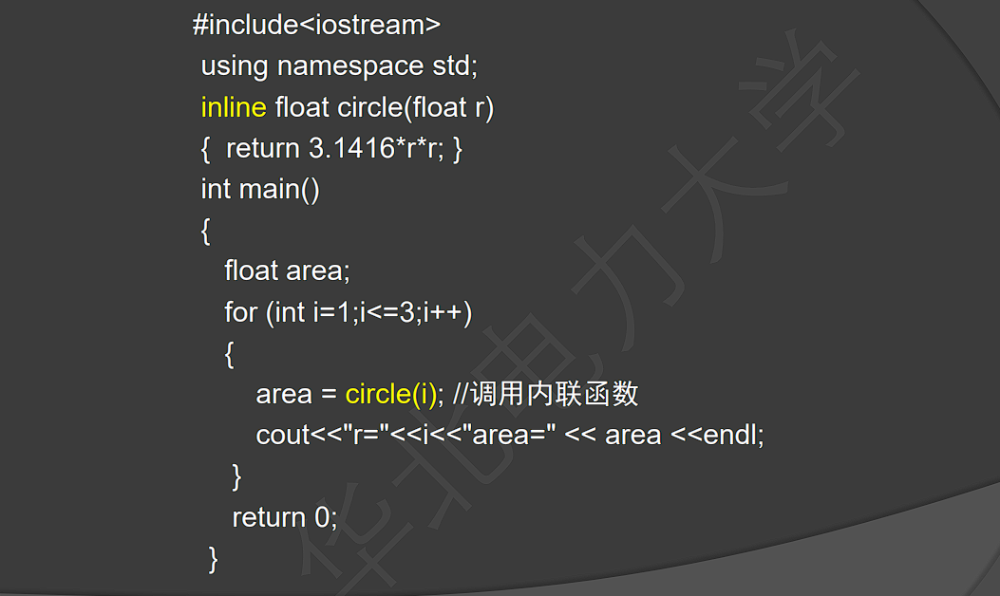

# C++

## 语法

### const

先确定一个规则：const默认与左边结合，左边没有东西则与右边结合。在这个规则下进行分析。

1.const int* a

const与int结合，因此变量a是一个指向常量整型的指针。

2.int const * a

const与int结合，因此变量a与1同。

3.int* const  a

const与*结合，因此变量a是一个指向整型的常量指针。

4.const int* const a

第1个const与int结合，第2个const与*结合，因此变量a是一个指向常量整型的常量指针。

5.int const * const a

第1个const与int结合，第2个const与*结合，因此变量a与上同。

6.int const * const * a

第1个const与int结合，第2个const与左边的*结合，而变量a前还有1个多出来的*，因此变量a是一个二级指针，即指向4/5中常量指针的指针。

7.int const * const * const a

第1个const与int结合，第2个const与左边的*结合，第3个const也与左边的*结合，因此变量a是一个常量二级指针，即指向4/5中常量指针的常量指针。

附注：1.常量整型不可改值。2.常量指针不能修改指针的指向。

- 修饰函数参数时，参数值不能改变

### 命名空间

~~~c++
namespace name{
    //variables,functions,classes
}
~~~

### char

对于char数组在类中的操作

~~~c++
class C{
private:
    char * a;
public:
    C(char* a="");
    ~C();
}
C::C(char* s){
	a = new char[strlen(s)+1];
    strcpy(a,s);
    cout<<a<<endl;
}
C::~C(){
	delete [] a;
}
~~~

### this

- 每个成员函数前默认有`类名* const this`

- 用途
  - `if(this==&Student) return;`
  - `return *this;`
  - `this->n=n;`

### 同名成员

派生类调用基类的同名成员`Cperson::DisplayInfo()`

派生类对象调用基类的同名成员`Student1.Cperdon::DisplayInfo();`

### 访问声明

`B::f;`在私有继承的派生类中调用父类的函数

### 赋值兼容规则

- 通过public继承，可以将派生类的对象看作基类的对象

### 虚基类

`class B:public virtual A`

- 对于后续派生类只产生一个副本

### 虚函数

在基类上定义`virtual public getInfo()`，在派生类中覆盖，并使用基类指针指向派生类对象，可以实现函数的多态性

- 必须进行public继承
- 函数必须完全一致，包括const

- 在 C++ 中，"^" 是按位异或运算符，而不是幂运算符，因此代码中使用 "(i^2 + t^2)" 计算平方和是错误的

## 常用函数

### 内联函数

- 空间换时间
- 不能有for和switch等复杂语句

### sort

~~~c++
#include<iostream>
#include<algorithm>
using namespace std;
//sort(begin,end,cmp);
//begin为指向待sort()的数组的第一个元素的指针，end为指向待sort()的数组的最后一个元素的下一个位置的指针，cmp参数为排序准则，cmp参数可以不写，默认从小到大进行排序,想从大到小排序可以将cmp参数写为greater<int>()
int main(){
    int num[10] = {6,5,9,1,2,8,7,3,4,0};
	sort(num,num+10,greater<int>());
	for(int i=0;i<10;i++){
		cout<<num[i]<<" ";
	}//输出结果:9 8 7 6 5 4 3 2 1 0
	return 0;
}
~~~

### 析构函数

- 在对象消亡时被自动调用

- `~CStudent();`

- ~~~c++
  CStudent::~CStudent(){
  	delete []m_strname;
  }
  ~~~

- 一般是要在main函数最后加一个return 0;

### 复制构造函数

`CStudent(const CStudent &student);`

## STL

- 仿函数
  - 容器类
    - 顺序容器
      - 向量
      - 线性表
      - 双向队列
    - 关联容器
      - 集合
      - 多元集合
      - 映射
      - 多元映射
- 算法
- 迭代器
- 空间配置器
- 容器
- 配接器

### 迭代器

- `vector<int>::iterator intlter;`

- ~~~c++
  intler = vec.begin();//指向第一个位置
  intler = vec.end();///指向最后一个元素的下一个位置，即一个不存在的元素
  ++intlter;//指向容器中的下一个元素
  *(intlter+2)//返回当前位置之后两个位置上的元素
  
  vector<int>::iterator intler,itEnd;
  itEnd = vec.end();
  for(intler = vec.begin();intlter!=itEnd;intlter++)
      cout<<* intlter<<" ";
  
  rbegin(),rend()//反向迭代器
  ~~~

- | 容器                               | 对应的迭代器类型 |
  | ---------------------------------- | ---------------- |
  | array                              | 随机访问迭代器   |
  | vector                             | 随机访问迭代器   |
  | deque                              | 随机访问迭代器   |
  | list                               | 双向迭代器       |
  | set / multiset                     | 双向迭代器       |
  | map / multimap                     | 双向迭代器       |
  | forward_list                       | 前向迭代器       |
  | unordered_map / unordered_multimap | 前向迭代器       |
  | unordered_set / unordered_multiset | 前向迭代器       |
  | stack                              | 不支持迭代器     |
  | queue                              | 不支持迭代器     |

### 容器

#### 向量vector

- 初始化

  ~~~c++
  vector<int> v7(5, -1); //初始化为-1,-1,-1,-1,-1。第一个参数是数目，第二个参数是要初始化的值
  ~~~

- 添加元素

  - `v1.push_back(i);`
  - 告诉编译器为新元素开辟空间、将新元素存入新空间里

- 插入元素

  - v2.insert()

  - 

  - ~~~c++
    std::vector<int> demo{1,2};
        //第一种格式用法
        demo.insert(demo.begin() + 1, 3);//{1,3,2}
    ~~~

- 删除元素

  - 

  - 

  - ~~~c++
    for(vector<int>::iterator iter=v1.begin();iter!=v1.end();)
        if(*iter==3)
            iter = v1.erase(iter);
    	else
            iter++;
    ~~~

  - 

- 使用 **resize()** 容器内的对象内存空间是真正存在的。//对应size

  使用 **reserve()** 仅仅只是修改了 capacity 的值，容器内的对象并没有真实的内存空间(空间是"野"的)。//对应capacity

- 一些函数

  - v2.begin()//返回第一个元素的迭代器

  - v2.end()//返回最后一个元素的迭代器

  - v2.size()

  - v2.assign() //重新分配空间

  - v2.at(index) //返回指定位置元素的引用

  - v2.front()//返回第一个元素的引用

  - v2.back();//返回最后一个元素的引用

  - `vector<int>::iterator intleter;`迭代器

#### 链表list

- 是一个双向链表

- 只能顺序访问，不能随机访问

- 优点：插入删除效率高

- 缺点：查找较慢

- ~~~c++
  std::list<int> values1(5);
  std::list<int> values2(values1);
  
  //拷贝普通数组，创建list容器
  int a[] = { 1,2,3,4,5 };
  std::list<int> values(a, a+5);
  
  //拷贝其它类型的容器，创建 list 容器
  std::array<int, 5>arr{ 11,12,13,14,15 };
  std::list<int>values(arr.begin()+2, arr.end());//拷贝arr容器中的{13,14,15}
  ~~~

- 为双向迭代器

#### 集合set

- 采用红黑树存储
- 使用 set 容器存储的各个键值对，要求键 key 和值 value 必须相等

- **lower_bound(key_value)** ，返回第一个大于等于key_value的定位器

  **upper_bound(key_value)，**返回最后一个大于等于key_value的定位器

- `std::set<std::string> myset;`
- `std::set<std::string> copyset(myset);`

#### map

- key-value(key唯一)
- 只能根据key查找或删除

~~~c++
map<int,string>mapStudent;
//插入
mapStudent.insert(pair<int,string>(000,"aaa"));
mapStudent.insert(map<int,string>::value_type(001,"aaa"));
mapStudent[12] = "aaaa";
//查找
iter = mapStudent.find("aaa");//返回迭代器指向查找元素的位置，否则返回map::end()位置
~~~

- 输出：`cout<<"<"<<iter->first<<", "<<iter->second<<endl;`

### 算法

#### sort()

- 默认升序
- 基于快速排序
- 只对 array、vector、deque 这 3 个容器提供支持
- 无法保证相对位置不变
- `sort (first, last)`  `sort (first, last,mycmp())`

#### find()

- `find(first,last,value)`
- 返回指向value值的迭代器，没有则指向last
- 必须支持==

for_each

- `for_each(first,last,fun)`
- fun可以是函数或函数对象

### 函数对象

- 定义

  - 一个类将()重载为成员函数，这个类的对象就是函数对象

- ~~~c++
  template<class T>
  class SumPowers
  {
  private:
      int power;
  public:
      SumPowers(int p) :power(p) { }
      const T operator() (const T & total, const T & value)
      { //计算 value的power次方，加到total上
          T v = value;
          for (int i = 0; i < power - 1; ++i)
              v = v * value;
          return total + v;
      }
  };
  int main()
  {
      const int SIZE = 10;
      int a1[] = { 1,2,3,4,5,6,7,8,9,10 };
      vector<int> v(a1, a1 + SIZE);
      cout << "1) "; PrintInterval(v.begin(), v.end());
      int result = accumulate(v.begin(), v.end(), 0, SumSquares);
      cout << "2) 平方和：" << result << endl;
      result = accumulate(v.begin(), v.end(), 0, SumPowers<int>(3));
      cout << "3) 立方和：" << result << endl;
      result = accumulate(v.begin(), v.end(), 0, SumPowers<int>(4));
      cout << "4) 4次方和：" << result;
      return 0;
  }
  ~~~

- 函数对象可以有自己的状态。我们可以在类中定义状态变量，这样一个函数对象在多次的调用中可以共享这个状态。但是函数调用没这种优势，除非它使用全局变量来保存状态。

- 函数对象有自己特有的类型，而普通函数无类型可言。这种特性对于使用C++标准库来说是至关重要的。这样我们在使用STL中的函数时，可以传递相应的类型作为参数来实例化相应的模板，从而实现我们自己定义的规则。

## 注意点

- 不能在类初始化变量时赋值
- 类数据成员默认为private
