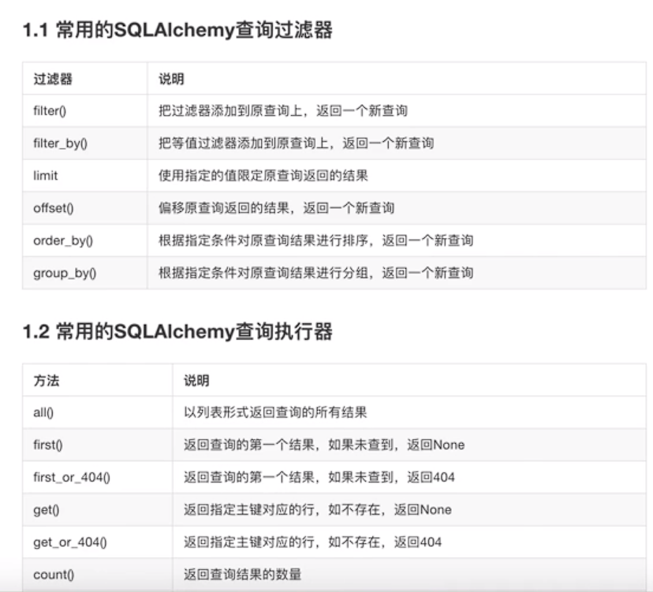
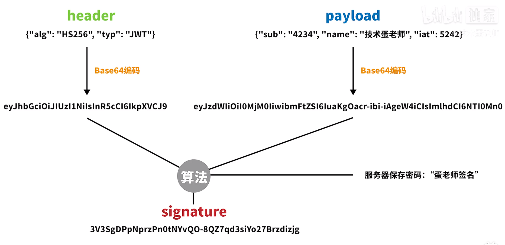

# Flask

## 简介

- 现有需求，后有解决工具
- 重点是研究并理解问题的内在本质，及解决问题的思想和思路

- 没有最好的工具，只有更合适的工具
- 学习目标
  - 明确问题及其背景
  - 理解并掌握解决问题的思想和思路
  - 理解后熟练运用工具

- 学习方法

  - 不机械的抄代码、背代码，锻炼自己写代码的能力

  - 先思考再动手

    先想清问题是什么，再想清解决思路，最后动手将思路实现

  - 多思考勤动手

    多问自己为什么，多提出不同的解决方式再动手验证可行性，多调bug

- 框架的学习目标
  - 如何编写视图
  - 如何处理请求
  - 如何构造响应

- Flask框架
  - 核心 werkzerug + Jinja2

## 初始化参数

### Flask对象初始化参数

- import_name   `app = Flask(__name__)`用于定位主工程目录
- static_url_path
  - 静态文件访问路径，可以不传，默认为：`/ + static_folder`

- static_folder
  - 静态文件存储的文件夹，可以不传，默认为 `static`
- template_folder
  - 模板文件存储的文件夹，可以不传，默认为 `templates`

### 应用程序配置参数

**从配置对象中加载**

```python
app.config.from_object(配置对象)
class DefaultConfig(object):
    """默认配置"""
    SECRET_KEY = 'TPmi4aLWRbyVq8zu9v82dWYW1'

app = Flask(__name__)

app.config.from_object(DefaultConfig)

@app.route("/")
def index():
    print(app.config['SECRET_KEY'])
    return "hello world"
```

应用场景：

作为默认配置写在程序代码中

可以继承

```python
class DevelopmentConfig(DefaultConfig):
    DEBUG=True
```

**从配置文件中加载**

```
app.config.from_pyfile(配置文件)
```

- 优点：独立文件
- 缺点：不能继承

新建一个配置文件setting.py

```python
SECRET_KEY = 'TPmi4aLWRbyVq8zu9v82dWYW1'
```

**从环境变量中加载**

app.config.from_envvar('环境变量名')

环境变量的值为配置文件的绝对路径

先在终端中执行如下命令

```shell
export PROJECT_SETTING='~/setting.py'
```

- 可以先从对象中加载，再从环境变量中覆盖

### app.run 参数（旧版

可以指定运行的主机IP地址，端口，是否开启调试模式

```python
app.run(host="0.0.0.0", port=5000, debug = True)
```

关于DEBUG调试模式

1. 程序代码修改后可以自动重启服务器
2. 在服务器出现相关错误的时候可以直接将错误信息返回到前端进行展示

### 目录

resources 用来存放逻辑实现的代码（比如做一些接口的处理）
static 用来存放前端文件（css，js，img）
templates 用来存放 模版文件 通过render_template(“404.html”)使用
view 存放视图函数

## 路由

- 命令行`flask routes`

- 读取url_map属性

  - ```python
    for rule in app.url_map.iter_rules():
        print('name={} path={}'.format(rule.endpoint, rule.rule))
    ```

~~~python
@app.route('/python/')
def hello_python():
    return 'Hello Python'
~~~

## 模板

~~~python
@app.route('/')
def index():
	return render_template('index.html')
~~~

- 可以向模板传递参数

~~~python


#控制代码块
  <h1>Welcome to My Website!</h1>
  <p>This is the content of the 'content' block in the parent template.</p>
{{url}}#变量代码块

#可以写for然后tab进行补全

	{{ num }}

~~~

- 在模板引擎中，`` 标签用于定义可被子模板覆盖的区块。

过滤器：变量名|过滤器|过滤器

~~~python
{{ 'hello' | capitalize |reverse}}首字母转成大写
~~~

表单验证

~~~python
#原生方法
username = request.form.get('username')
~~~

- request是请求对象用于获取请求方式

重定向

~~~python
@app.route('/guest')
def index():
	return render_template('index.html')

@app.route('/user/<float:name>')#传参数限定类型
def hello(name):
    return redirect(url_for('index'))#重定向到指定函数
~~~

~~~python
@app.route('/result',methods = ['POST','GET'])#默认只支持get请求
def result():
	if request.method == 'POST':
		rst = request.form
        return render_template("results.html",result = rst)
    
<form action = "/result" methon="POST">
</form>#返回路由result函数来处理表单
~~~

- `abort(401)`使用”abort()”函数可以直接退出请求，返回错误代码
- 刷新是走get方法
- `url_for()` 函数是 Flask 框架中的一个实用函数，用于根据视图函数的名称和变量值生成对应的 URL

## WFT

- 利于表单验证

~~~python
from flask_wtf import FlaskForm
from wtforms import Form, BooleanField, StringField, PasswordField, validators
#首先定义一个表单类
class RegistrationForm(Form):
    username = StringField('Username',[validators.Length(min=4,max=25)])
    password = PasswordField('New Password', [
        validators.DataRequired(),
        validators.EqualTo('confirm', message='Passwords must match')
    ])
    confirm = PasswordField('Repeat Password')
    
#建立视图函数
@app.route('/register',methon=['GET','POST'])
def register():
    form = RegistrationForm(request.form)
    if request.method == 'POST' and form.validate():
        user = User(form.username.data, form.email.data,
                    form.password.data)
        db_session.add(user)
        flash('Thanks for registering')
        return redirect(url_for('login'))
    return render_template('register.html', form=form)
~~~

~~~html
<form method=post>
  <dl>
    {{ render_field(form.username) }}
    {{ render_field(form.email) }}
    {{ render_field(form.password) }}
    {{ render_field(form.confirm) }}
    {{ render_field(form.accept_tos) }}
  </dl>
  <p><input type=submit value=Register>
</form>
~~~


## Cookie和Session

- cookie在客户端
  - set_cookie
  - get_cookie
  - delete_cookie
- session在服务器，sessionID在客户端，自动加密无法破解
- 1、存储在服务端：通过cookie存储一个session_id，然后具体的数据则是保存在session中。如果用户已经登录，则服务器会在cookie中保存一个session_id，下次再次请求的时候，会把该session_id携带上来，服务器根据session_id在session库中获取用户的session数据。就能知道该用户到底是谁，以及之前保存的一些状态信息。这种专业术语叫做server side session。
  2、将session数据加密，然后存储在cookie中。这种专业术语叫做client side session。flask采用的就是这种方式，但是也可以替换成其他形式

cookie

- 在Flask中操作cookie，是通过response对象来操作，可以在response返回之前，通过response.set_cookie来设置
- 获取：request.cookies.get(key, ‘默认值’)
- 设置：resp.set_cookie(key, value, max_age=整数)
- 删除：resp.delete_cookie(key)

session

- 存放用户信息
- 使用session时一定要设置一个密钥”app.secret_key”

## 消息闪现

希望在模板中动态的传递消息

~~~python
#模板中需要去遍历消息
将print换成flash(u'succsee')#加u解决编码问题

from flask import flash
app.secret_key = '123456'

	{{message}}

~~~

- 需要对内容加密，设置`secret_key`

## 请求

### 类型

GET

OPTIONS(自带)    -> 简化版的GET请求 用于询问服务器接口信息的

比如接口允许的请求方式  允许的请求源头域名

+ CORS 跨域  django-cors  ->中间件中拦截处理了options请求

+ www.meiduo.site  -> api.meiduo.site/users/1

  + options  api.meiduo.site/uses/1

    返回response  -> allow-origin 'www.meiduo.site'

  * GET api.meiduo.site/users/1

HEAD(自带)  简化版的GET请求

* 只返回GET请求处理时的响应头头，不返回响应体

自定 POST  PUT  DELETE  PATCH

 405 Method not allowed（类型不对报错

- 可以使用methods限制请求条件

---


## 蓝图

- 蓝图的基本概念是：在蓝图被注册到应用之后，所要执行的操作的集合

- 放在一个app里方便复用扩展和移植
- 对应django的app（子应用

存储一组视图方法的容器对象

- 一个应用可以具有多个Blueprint
- 可以将一个Blueprint注册到任何一个未使用的URL下比如 “/user”、“/goods”
- Blueprint可以单独具有自己的模板、静态文件或者其它的通用操作方法，它并不是必须要实现应用的视图和函数的
- 在一个应用初始化时，就应该要注册需要使用的Blueprint

但是一个Blueprint并不是一个完整的应用，它不能独立于应用运行，而必须要注册到某一个应用中。

### 定义

~~~python
user_bp=Blueprint('user',__name__)#1.创建蓝图对象
@user_bp.route('/')#2.使用蓝图装饰视图函数
def user_profile():
    return 'user_profile'
app.register_blueprint(user_bp)#3.将蓝图注册到app中
~~~

### 内部静态文件

和应用对象不同，蓝图对象创建时不会默认注册静态目录的路由。需要我们在 创建时指定 static_folder 参数。

下面的示例将蓝图所在目录下的static_admin目录设置为静态目录

```python
admin = Blueprint("admin",__name__,static_folder='static_admin')
app.register_blueprint(admin,url_prefix='/admin')
```

### 蓝图内部模板目录

蓝图对象默认的模板目录为系统的模版目录，可以在创建蓝图对象时使用 template_folder 关键字参数设置模板目录

```python
admin = Blueprint('admin',__name__,template_folder='my_templates')
```

以包的方式使用

导入视图放到最后的原因


* 循环引用==顺序不能错！！！==

  ```python
  #__init__py文件
  from flask import Blueprint
  
  goods_bp = Blueprint('goods', __name__)
  
  from . import views  # 此处
  ```

- ~~~python
  #view.py
  @goods_bp.route('/index')
  def home():
      return render_template('index.html')
  ~~~

要使用`static_folder`需指定`url_prefix`参数

- `user_blue = Blueprint("user",__name__,staic_folder="static",url_prefix="/user")`
- static_folder用来存储静态文件
- url_prefix给所有使用user_blue装饰的视图函数都加上一个访问前缀

## 请求与响应

### 处理请求

- URL路径参数（动态路由）

例如，有一个请求访问的接口地址为`/users/123`，其中123实际上为具体的请求参数，表明请求123号用户的信息。此时如何从url中提取出123的数据？

Flask不同于Django直接在定义路由时编写正则表达式的方式，而是采用转换器语法：

```python
@app.route('/users/<user_id>')
def user_info(user_id):
    print(type(user_id))
    return 'hello user {}'.format(user_id)
```

此处的`<>`即是一个转换器，默认为字符串类型，即将该位置的数据以字符串格式进行匹配、并以字符串为数据类型类型、 `user_id`为参数名传入视图。

### 响应

视图函数的返回值会自动转换为一个响应对象。

设想有如下视图:

```python
@app.errorhandler(404)
def not_found(error):
    return render_template('error.html'), 404
```

可以使用 [`make_response()`](https://flask.net.cn/api.html#flask.make_response) 包裹返回表达式，获得响应对象，并对该对象 进行修改，然后再返回:

```python
@app.errorhandler(404)
def not_found(error):
    resp = make_response(render_template('error.html'), 404)
    resp.headers['X-Something'] = 'A value'
    return resp
```

## 数据库

使用SQLAlchemy

~~~python
#配置
from flask import Flask
from flask_sqlalchemy import SQLAlchemy

# create the extension
db = SQLAlchemy()
# create the app
app = Flask(__name__)
# configure the SQLite database, relative to the app instance folder
app.config["SQLALCHEMY_DATABASE_URI"] = "sqlite:///project.db"
# initialize the app with the extension
db.init_app(app)
#定义模型
class User(db.Model):
    id = db.Column(db.Integer, primary_key=True)
    username = db.Column(db.String, unique=True, nullable=False)
    email = db.Column(db.String)
    role_id = db.Column(db.Interger,db.ForeignKey('roles.id'))#连接外键
~~~

基本操作

~~~python
#删除表
db.drop_all()
#创建表
db.create_all()
~~~

- `db.FetchedValue()` 表示使用数据库的默认值作为该列的默认值



## WSGI

一个基本的 WSGI 应用程序可以是一个函数或一个可调用的对象，它接受两个参数：`environ` 和 `start_response`。

- `environ` 是一个包含了 HTTP 请求信息的字典，如请求的方法、路径、查询参数、请求头等。
- `start_response` 是一个函数，用于设置响应状态码和响应头

~~~python
def application(environ, start_response):
    # 从环境变量中获取请求信息
    method = environ['REQUEST_METHOD']
    path = environ['PATH_INFO']
    
    # 设置响应状态码和响应头
    status = '200 OK'
    response_headers = [('Content-Type', 'text/plain')]
    start_response(status, response_headers)
    
    # 返回响应内容
    if method == 'GET' and path == '/hello':
        return [b'Hello, World!']
    else:
        return [b'Not Found']
~~~

还需创建一个简单的服务器

~~~python
from wsgiref.simple_server import make_server

# 创建服务器并运行应用程序
httpd = make_server('localhost', 8000, application)
httpd.serve_forever()
~~~

自定义路由转换器

~~~python
class ReConverter(BaseConverter):
    """"""

    def __init__(self, url_map, regex):
        # 调用父类初始化方法
        super(ReConverter, self).__init__(url_map)

        # 保存正则表达式
        self.regex = regex
#需要显示的指定转换器        
app.url_map.converters['re'] = ReConverter
#使用正则表达式进行匹配
@app.route('/user/<re("[a-zA-Z0-9_-]{3,20}"):username>')
def user_profile(username):
    # 处理用户个人资料页面
    return 'User Profile: {}'.format(username)

~~~

## token



~~~python
from flask import current_app
from itsdangerous import TimedJSONWebSignatureSerializer as Serializer

from utils.response_code import RET


class UserTokenService:

    # token生成
    @classmethod
    def create_token(cls, _username, _role):
        """
        生成新的token
        :param _userid:用户id
        :param _username:用户name
        :param _usertype: 用户type 1——学生 2——教师 3——企业用户
        :return: token
        """
        # 第一个参数是内部的私钥(配置信息)，第二个参数是有效期(秒)
        s = Serializer(current_app.config["SECRET_KEY"], expires_in=current_app.config["TOKEN_EXPIRES"])

        # 接受用户id转换编码
        token = s.dumps({"username": _username, "role": _role}).decode(
            "ascii")
        return token

    # 根据token获取用户信息
    @classmethod
    def get_user_by_token(cls, token):
        """
        校验token
        :param token:token值
        :return: 用户信息 or None
        """
        # 参数为私有密钥，与生成token的密钥一致
        s = Serializer(current_app.config["SECRET_KEY"])
        try:
            # 转换为字典
            data = s.loads(token)
            return {'code': RET.OK, 'message': 'OK', 'data': data}
        except Exception as e:
            return {'code': RET.SESSIONERR, 'message': '用户未登录或登录已过期', 'error': '用户未登录或登录已过期'}
~~~

- `s.dumps({"username": _username, "role": _role})` 是使用 `dumps()` 函数将字典对象转换为令牌字符串。而 `.decode("ascii")` 则是使用 `decode()` 方法将令牌字符串从字节字符串转换为 ASCII 字符串。

~~~python
if request.endpoint not in permission:
    # 在请求头上拿到token
    token = request.headers.get("Token")
    r=request
    if not all([token]):
        return jsonify(code=RET.PARAMERR, message="缺少参数Token或请求非法")
    # 将用户信息保存到g对象,验证token
    from service.userTokenService import UserTokenService
    result_dict = UserTokenService.get_user_by_token(token)
    if result_dict['code'] == RET.OK:
        g.user = result_dict['data']
    else:
        return jsonify(code=result_dict['code'], message=result_dict['message'])
~~~

- `Serializer` 类是 `itsdangerous` 库中的一个核心类，用于生成和解析令牌（Token）。它通过将数据序列化并进行签名来创建令牌，并可以将令牌反序列化回原始数据。

## Flask开发流程

写一个暴露给前端的接口

1. 在`__init__`文件中新建蓝图

   ~~~python
   from flask import Blueprint
   superemployeeinfo_blueprint = Blueprint('SuperEmployeeInfo',__name__)
   from . import urls#注意顺序！！！
   #在注册蓝图时，使用蓝图的对象名
   app.register_blueprint(superemployeeinfo_blueprint)
   #在其它部分引用蓝图时，可以用蓝图的名称
   url_for('SuperEmployeeInfo')
   ~~~

2. 在url.py中新建一个路由函数return一个参数解析方法(在OtherResource中)

   ~~~python
   api = Api(superemployeeinfo_blueprint)
   #Api是flask_restful库中的一个类。它是用于管理和注册资源类（Resource）和路由的核心对象。
   api.add_resource(SuperEmployeeInfoResource, '/super-employee-info/<AutoID>', '/super-employee-info',endpoint='SuperEmployeeInfo')
   #通过api.add_resource()方法将SuperEmployeeInfoResource类与两个URL路由进行关联
   #endpoint参数用于指定路由的名称，可以在应用程序中引用和生成URL。
   #若指定多个路由，则先第一个来，若想指定为第二个，可使用url = url_for('SuperEmployeeInfo', AutoID=None)
   @superemployeeinfo_blueprint.route('/super-employee-info/login', methods=['POST'], endpoint='login')
   def login():
       return SuperEmployeeInfoOtherResource.login()
   ~~~

3. 写一个参数解析验证方法给kwargs，传给具体操作函数(在service中)

   ~~~python
   class SuperEmployeeInfoOtherResource(Resource):#继承资源类
   	@classmethod
   	def login(cls):
   		parser = reqparse.RequestParser()
   		parser.add_argument('SuperID', type=int, location='form', required=True, help='SuperID参数类型不正确或缺失')
   		parser.add_argument('UserName', type=str, location='form', required=True, help='UserName参数类型不正确或缺失')
   		parser.add_argument('Passwd', type=str, location='form', required=True, help='Passwd参数类型不正确或缺失')
   		parser.add_argument('Status', location='args', required=False, help='Status参数类型不正确或缺失')
   #使用了reqparse.RequestParser()创建了一个请求参数解析器对象parser，并添加了需要解析的参数规则
   		try:
   			kwargs = parser.parse_args()
   #使用parse_args()方法从请求中解析参数并将其存储为关键字参数的字典对象
   			kwargs = commons.put_remove_none(**kwargs)
   #通过parser.parse_args()方法解析请求中的参数，并使用commons.put_remove_none(**kwargs)将参数中的None值移除
   		except Exception as e:
   			loggings.exception(1, e)
   			return jsonify(code=RET.PARAMERR, message="参数类型不正确或缺失", error="参数类型不正确或缺失")
   
   		res = SuperEmployeeInfoService.login(**kwargs)
   
   		if res['code'] == RET.OK:
   			return jsonify(code=res['code'], message=res['message'], data=res['data'])
   
   		else:
   			return jsonify(code=res['code'], message=res['message'], error=res['error'])
   ~~~

   - 资源类（Resource class）是指继承自`flask_restful.Resource`的类。资源类用于定义API的处理逻辑，每个资源类对应一组相关的API端点。

4. 在service中写具体的操作函数

## 查询参数

1. 查询字符串（Query String）：查询字符串是一种常见的方式，参数以键值对的形式附加在 URL 的末尾，使用 `?` 开始，并使用 `&` 连接不同的参数。例如：`/api?param1=value1&param2=value2`
2. 路径参数（Path Parameters）：路径参数是将参数嵌入到 URL 路径中的一种方式，通常用于表示资源的标识符或唯一值。路径参数是通过使用占位符（通常使用尖括号或花括号）将参数值插入到 URL 中的特定位置。例如：`/api/resource/{id}`
3. 请求体（Request Body）：某些请求（如 POST 和 PUT）可以在请求体中传递参数。请求体是一个与请求一起发送的数据块，通常以 JSON 或表单数据的形式传递参数。
4. 请求头（Request Headers）：请求头是包含在 HTTP 请求头部中的键值对，可以用于传递参数或其他元数据信息。

- 根据您的需求和使用场景，可以选择适合的方式来传递参数。一般来说，查询字符串适用于筛选、排序、分页等操作，而路径参数适用于唯一资源的标识或指定特定的子资源。请求体通常用于传递复杂的数据结构，例如 JSON 对象。
- 在 Flask-RESTful 中，您可以使用 `reqparse.RequestParser()` 请求解析器来解析路径参数、查询参数和请求体中的参数。使用 `location` 参数来指定参数的位置，例如 `location='args'` 表示查询参数，`location='json'` 表示请求体中的 JSON 数据。

## 加密和解密

~~~python
#rsa_encryption_decryption.py
encrypt_pwd=RSAEncryptionDecryption.encrypt(kwargs.get('Passwd'))
~~~

## 越权问题

垂直越权

- ```
  # 定义一个装饰器: 用户角色验证（解决垂直越权问题：验证用户的类型是否有权操作调用接口）
  ```

平级越权
