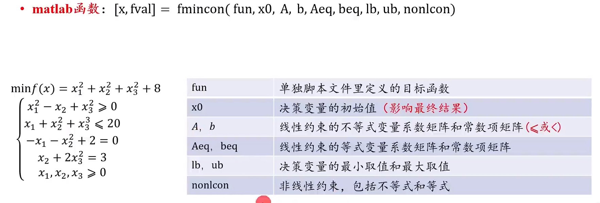

# Matlab

## 基本操作

- clc清空命令行
- clear清空工作区
- 加分号不会在命令行输出

## 矩阵运算

~~~matlab
B = A'  %求转置
[D,V] =eig(A) %求特征值和特征向量
E = inv(A) %求逆矩阵
F = A.*B %点乘
x =A/B %A逆乘B 
~~~

## 常见绘图

~~~matlab
x = 0:0.5:30;
y = sin(x);
plot(x,y)
%线状图
~~~


## 基本函数

- size
  - size(X,1)表示返回行数
  - size(X,2)表示返回列数
- sort
  - sort(A)若A是向量不管是列还是行向量，默认都是对A进行升序排列。sort(A)是默认的升序，而sort(A,'descend')是降序排序。
  - sort(A,dim)  1对列，2对行
  - 若欲保留排列前的索引，则可用 [sA,index] = sort(A,'descend') ，排序后，sA是排序好的向量，index是向量sA中对A的索引。

## 算法函数

### 线性规划

- linprog

用于求最小值问题，要求最大值得加一个-

~~~matlab
%{
x=linprog(f,A,b,Aeq,beq,lb,ub,x0)
f：目标函数  只能为一个向量
A：不等式约束条件矩阵
b：对应不等式右侧的矩阵
Aeq：等式约束条件矩阵
beq：对应等式右侧的矩阵
lb：x的下界
ub：x的上界
x0：设置初始点x0
%}

f=[7,4];
A = [1,1;3,2;2,1];
b =[12 26 16];
lb =[0 0];
[x,fval]=linprog(-f,A,b,[],[],lb,[]);
disp(x)
disp(-fval)
~~~

### 非线性规划



fun =@obj_f  该函数写在文件后面

```matlab
function [c,ceq] = mycon(x)  %非线性约束
c = ...     % Compute nonlinear inequalities at x.
ceq = ...   % Compute nonlinear equalities at x.
```
