# MySQL

### 使用终端操作数据库

##### 登陆数据库服务器

- mysql -uroot -p
- 修改密码`ALTER USER 'root'@'localhost' IDENTIFIED BY '123456';`

##### 查询所有数据库

​	show databases;

##### 选中数据库

use databasesName

##### 删除数据库

`drop database <数据库名>;`

- ```sql
  INT UNSIGNED AUTO_INCREMENT//非负整数自动递增
  ```

##### 创建数据表

~~~sql
CREATE TABLE runoob_tbl(
   -> runoob_id INT NOT NULL AUTO_INCREMENT,
   -> runoob_title VARCHAR(100) NOT NULL,
   -> runoob_author VARCHAR(40) NOT NULL,
   -> submission_date DATE,
   -> PRIMARY KEY ( runoob_id )
   -> )ENGINE=InnoDB DEFAULT CHARSET=utf8;
~~~

- 如果你不想字段为 **NULL** 可以设置字段的属性为 **NOT NULL**， 在操作数据库时如果输入该字段的数据为**NULL** ，就会报错。
- AUTO_INCREMENT定义列为自增的属性，一般用于主键，数值会自动加1。
- PRIMARY KEY关键字用于定义列为主键。 您可以使用多列来定义主键，列间以逗号分隔。
- ENGINE 设置存储引擎，CHARSET 设置编码。
- 可以用CHECK短语指定满足条件

##### 删除数据表

DROP TABLE table_name ;`

##### 插入数据

(如果数据是字符型，必须使用单引号或者双引号，如："value"。)

```sql
INSERT INTO table_name ( field1, field2,...fieldN )
                       VALUES
                       ( value1, value2,...valueN );
```

##### 查询数据表

`select * from runoob_tbl;`

- ```sql
  SELECT column_name,column_name
  FROM table_name
  [WHERE Clause]
  [LIMIT N][ OFFSET M]
  ```

  - 查询语句中你可以使用一个或者多个表，表之间使用逗号(,)分割，并使用WHERE语句来设定查询条件。
  - SELECT 命令可以读取一条或者多条记录。
  - 你可以使用星号（*）来代替其他字段，SELECT语句会返回表的所有字段数据
  - 你可以使用 WHERE 语句来包含任何条件。
  - 你可以使用 LIMIT 属性来设定返回的记录数。
  - 你可以通过OFFSET指定SELECT语句开始查询的数据偏移量。默认情况下偏移量为0。

##### WHERE 子句

```sql
SELECT field1, field2,...fieldN FROM table_name1, table_name2...
[WHERE condition1 [AND [OR]] condition2.....
```

- 查询语句中你可以使用一个或者多个表，表之间使用逗号**,** 分割，并使用WHERE语句来设定查询条件。
- 你可以在 WHERE 子句中指定任何条件。
- 你可以使用 AND 或者 OR 指定一个或多个条件。
- WHERE 子句也可以运用于 SQL 的 DELETE 或者 UPDATE 命令。
- WHERE 子句类似于程序语言中的 **if 条件**，根据 MySQL 表中的字段值来读取指定的数据。

##### 更新数据

```
UPDATE table_name SET field1=new-value1, field2=new-value2
[WHERE Clause]
```

- 你可以同时更新一个或多个字段。
- 你可以在 WHERE 子句中指定任何条件。
- 你可以在一个单独表中同时更新数据。

##### 删除语句

```
DELETE FROM table_name [WHERE Clause]
```

- 如果没有指定 WHERE 子句，MySQL 表中的所有记录将被删除。
- 你可以在 WHERE 子句中指定任何条件
- 您可以在单个表中一次性删除记录。

##### WHERE LIKE 语句

```
SELECT field1, field2,...fieldN 
FROM table_name
WHERE field1 LIKE condition1 [AND [OR]] filed2 = 'somevalue'
```

- 你可以在 WHERE 子句中指定任何条件。
- 你可以在 WHERE 子句中使用LIKE子句。
- 你可以使用LIKE子句代替等号 **=**。
- LIKE 通常与 **%** 一同使用，类似于一个元字符的搜索。
- 你可以使用 AND 或者 OR 指定一个或多个条件。
- 你可以在 DELETE 或 UPDATE 命令中使用 WHERE...LIKE 子句来指定条件。
- `SELECT * from runoob_tbl  WHERE runoob_author LIKE '%COM';`

##### UNION操作符

MySQL UNION 操作符用于连接两个以上的 SELECT 语句的结果组合到一个结果集合中。多个 SELECT 语句会删除重复的数据

```sql
SELECT expression1, expression2, ... expression_n
FROM tables
[WHERE conditions]
UNION [ALL | DISTINCT]
SELECT expression1, expression2, ... expression_n
FROM tables
[WHERE conditions]
ORDER BY expression1;
```

- **expression1, expression2, ... expression_n**: 要检索的列。
- **tables:** 要检索的数据表。
- **WHERE conditions:** 可选， 检索条件。
- **DISTINCT:** 可选，删除结果集中重复的数据。默认情况下 UNION 操作符已经删除了重复数据，所以 DISTINCT 修饰符对结果没啥影响。
- **ALL:** 可选，返回所有结果集，包含重复数据。

#####  排序

```sql
SELECT field1, field2,...fieldN FROM table_name1, table_name2...
ORDER BY field1 [ASC [DESC][默认 ASC]],
```

- 你可以使用任何字段来作为排序的条件，从而返回排序后的查询结果。
- 你可以设定多个字段来排序。
- 你可以使用 ASC 或 DESC 关键字来设置查询结果是按升序或降序排列。 默认情况下，它是按升序排列。
- 你可以添加 WHERE...LIKE 子句来设置条件。

##### GROUP BY分组

```sql
SELECT column_name, function(column_name)
FROM table_name
[WHERE column_name operator value]
GROUP BY column_name;
```

##### 序列

- 自增序列AUTO_INCREMENT（在初始化时使用

  `id INT UNSIGNED NOT NULL AUTO_INCREMENT`

- 重置序列

  ```
  mysql> ALTER TABLE insect DROP id;
  mysql> ALTER TABLE insect
      -> ADD id INT UNSIGNED NOT NULL AUTO_INCREMENT FIRST,
      -> ADD PRIMARY KEY (id);
  ```

- 设置序列开始值

  ```
  mysql> CREATE TABLE insect
      -> (
      -> id INT UNSIGNED NOT NULL AUTO_INCREMENT,
  )engine=innodb auto_increment=100 charset=utf8;
  //或
  mysql> ALTER TABLE t AUTO_INCREMENT = 100;
  ```

##### ALTER命令

- 删除字段

  ```
  mysql> ALTER TABLE testalter_tbl  DROP i;
  ```

  如果数据表中只剩余一个字段则无法使用DROP来删除字段。

- ```
  mysql> ALTER TABLE testalter_tbl ADD i INT;
  ```

  执行以上命令后，i 字段会自动添加到数据表字段的末尾

  ```
  ALTER TABLE testalter_tbl ADD i INT FIRST;
  ALTER TABLE testalter_tbl ADD i INT AFTER c;
  //更改字段位置
  ```

- 修改字段类型及名称

  例如，把字段 c 的类型从 CHAR(1) 改为 CHAR(10)，可以执行以下命令:

  ```
  mysql> ALTER TABLE testalter_tbl MODIFY c CHAR(10);
  ```

  ```
  mysql> ALTER TABLE testalter_tbl CHANGE j j INT;
  ```

```sql
ALTER TABLE testalter_tbl ALTER i SET DEFAULT 1000;//修改字段默认值
ALTER TABLE testalter_tbl ALTER i DROP DEFAULT;
//删除字段默认值
```

- 修改表名

  ```sql
  ALTER TABLE testalter_tbl RENAME TO alter_tbl;
  ```

### BUGS

##### 排序后添加序列号

~~~

select distinct score 
from scores
order by score desc;
select @rank:=@rank + 1 AS num,a.* from
(select * from scores_tbl  order by score desc) a,
(SELECT @rank:= 0) b;
~~~


@rank 是 用户自定义的变量，:=是赋值的作用

### 模糊查询

[(27条消息) 数据库MySQL数据查询---模糊查询（like和relike(或regexp)）_转身～见的博客-CSDN博客_sql中relike](https://blog.csdn.net/qq_41025698/article/details/102563441)

### 视图

- 虚拟表 
- 在执行create view语句的结果只是把视图的定义存入数据字典，并不执行其中的select语句

分类

- 行列子集视图（单表
- 分组视图
- 带表达式的视图（带虚拟列

语法

- 创建：`create [or replace] view stu_v_1 as select id,name from student where id<= 10`

- 查询创建视图的语句：`show create stu_v_1`
- 查看视图数据：`select * from stu_v_1`

- 修改：`create or replace view stu_v_1 as select语句 [with[cascaded | local ] check option]`  
- 修改：`alter view stu_v_1 as select 语句`  
- 删除：`drop view [if exists] 视图名称 [CASCADE]`，加上cascade级联删除

检查选项

- 使用`with cascaded check option`，检查真正更改的每个行，以使其符合视图的定义

- cascaded用于基于另一个视图创建视图时，父视图的检查也会启用

- 检查选项的传递性

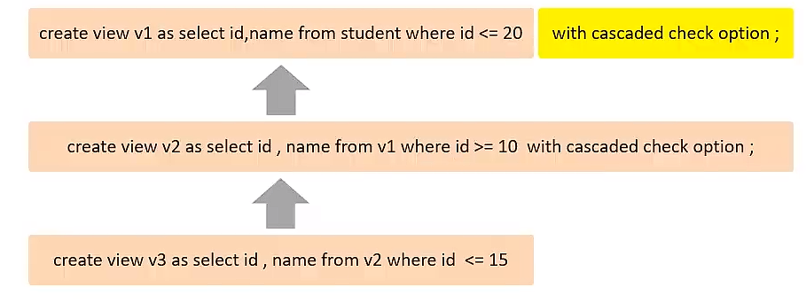

- local没有传递性

视图更新

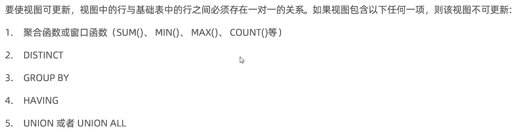

## DQL

### 基本查询

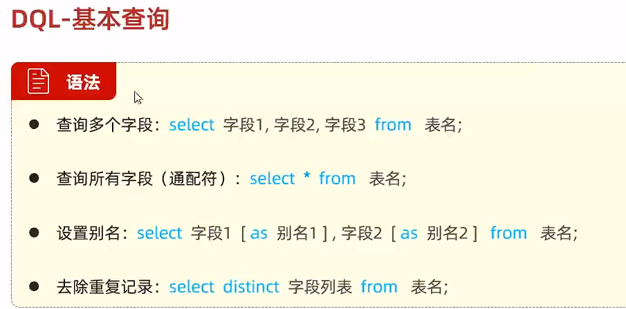

### 条件查询

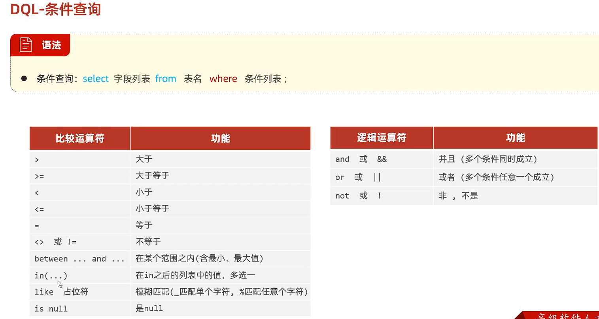

### 分组查询

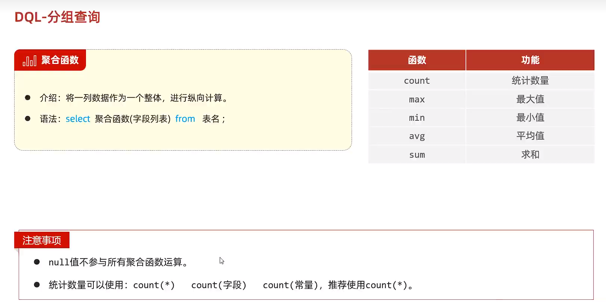

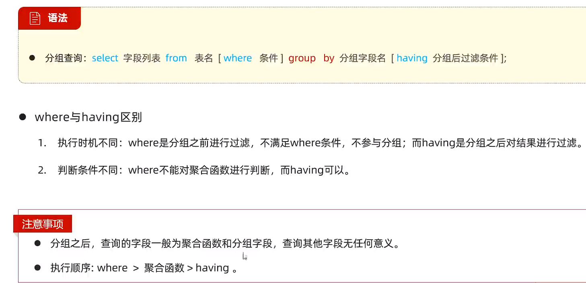

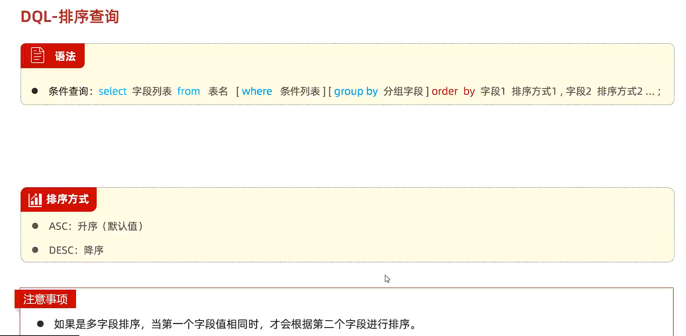

==where不能对聚合函数进行判断==

- count(*) 和 count(某个具体的字段) 他们有什么区别？
  - count(*):是统计的总记录条数
  - count(某个具体的字段):是统计当前这个字段不为NUll的数据总条数

- case when

  - ~~~sql
    SELECT
        EmployeeName,
        Salary,
        CASE Department
            WHEN 'HR' THEN Salary * 1.1
            WHEN 'IT' THEN Salary * 1.15
            WHEN 'Sales' THEN Salary * 1.12
            ELSE Salary
        END AS UpdatedSalary
    FROM Employees;
    ~~~

  - ~~~sql
    SELECT
        StudentName,
        Grade,
        CASE
            WHEN Grade >= 90 THEN 'A'
            WHEN Grade >= 80 THEN 'B'
            WHEN Grade >= 70 THEN 'C'
            ELSE 'F'
        END AS GradeLetter
    FROM Students;
    ~~~

### 分页查询

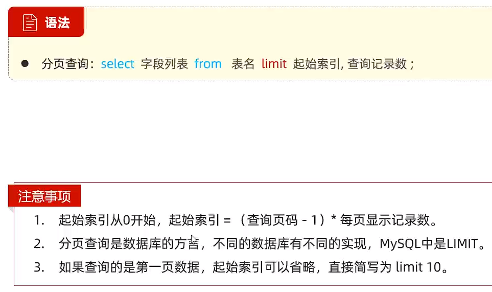

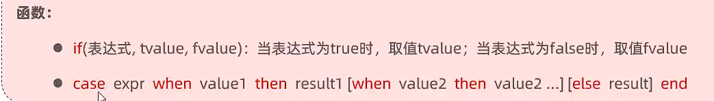

### 总结

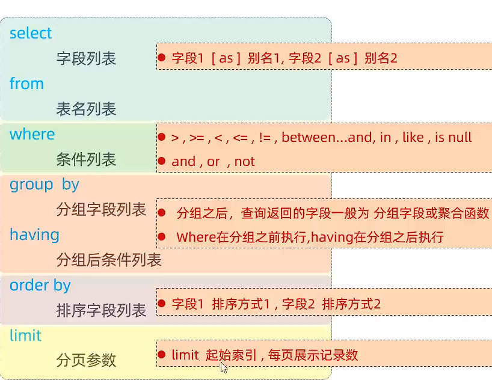

## 多表设计

### 外键

一对多

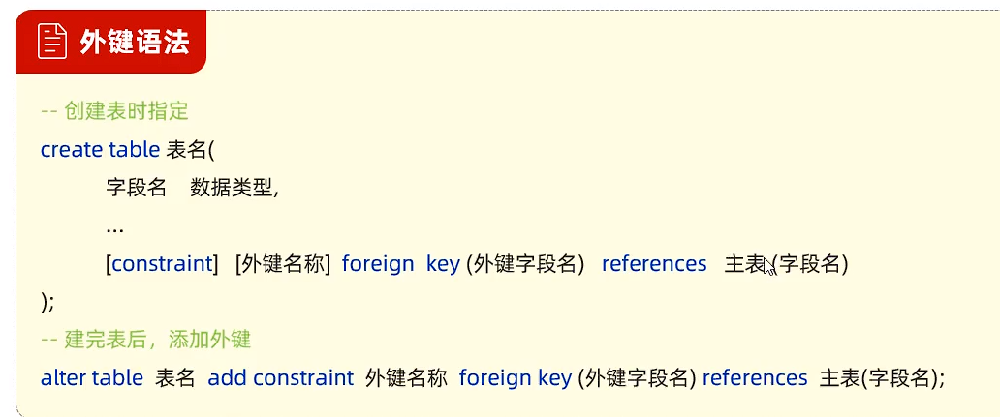

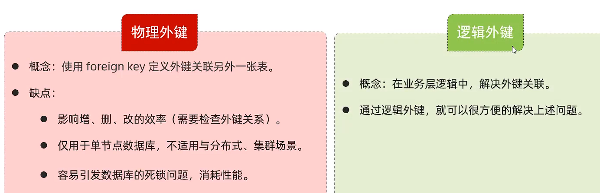

一对一 

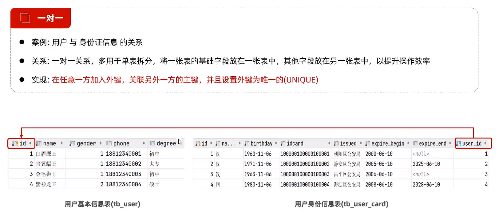

多对多

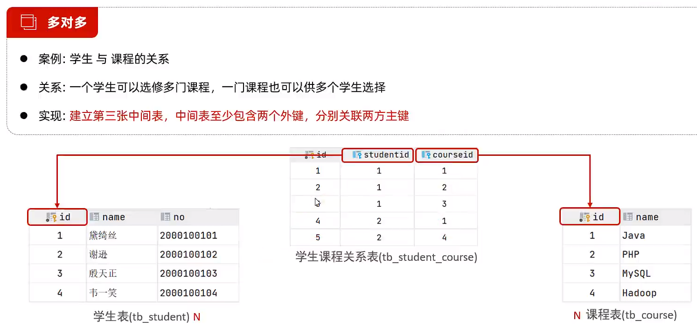

### 多表查询

- 在多表查询时，需要消除无效的笛卡尔积

链接查询

- 自然连接：`select sno from student natural join sc`

- 内连接
  - 
  - 只查询交集部分的数据
- 外连接
  - 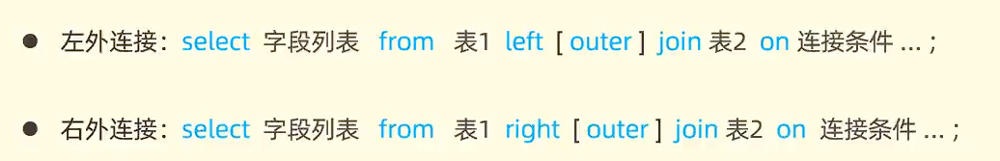
  - 完全包含左表或右表的数据

子查询 

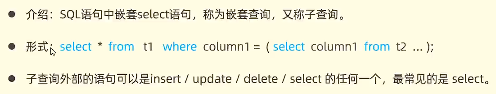

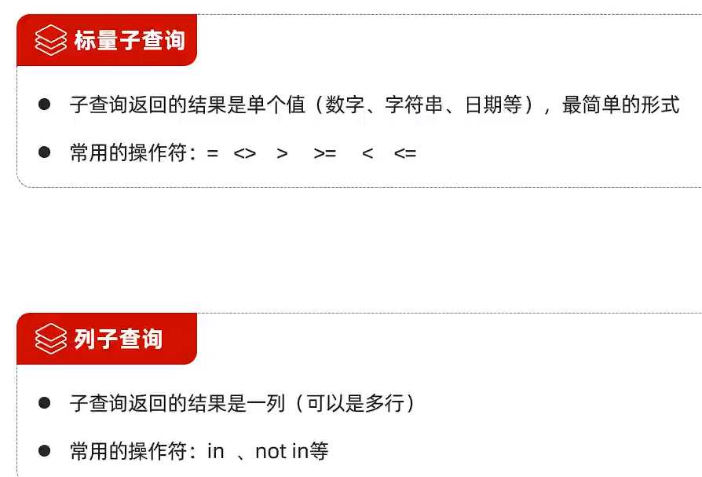

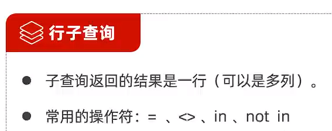


- 使用in时条件应单独列出`WHERE student.dept IN ('信息系', '计算机系');`

### 事务


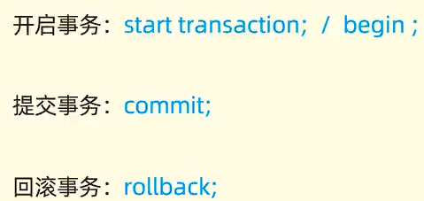

特性


### 索引

概念

- 帮助数据库高效获取数据的数据结构

结构

- MySQL默认B+Tree(多路平衡搜索树)

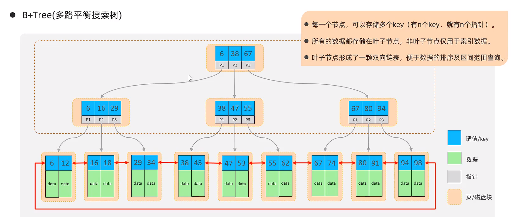

语法


- 主键和唯一约束会自动创建索引

## Tips

- `where Sno is Null`不能写成`where Sno=Null`空值不能进行运算，即avg或其它聚合运算时自动舍弃NULL
- 使用AS可以定义别名
