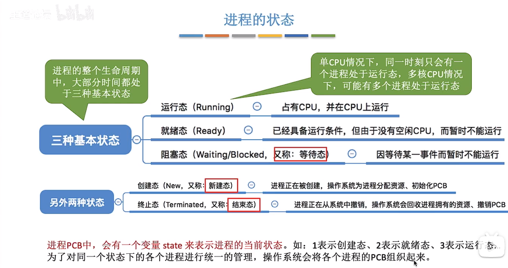
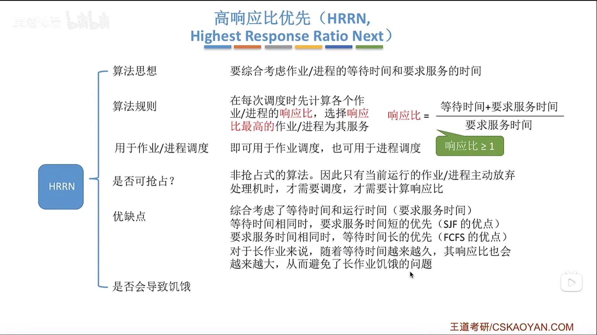
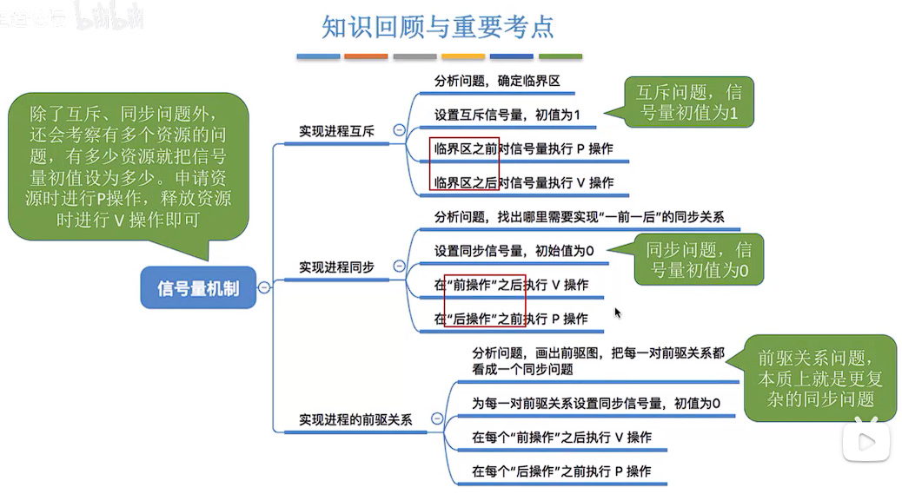
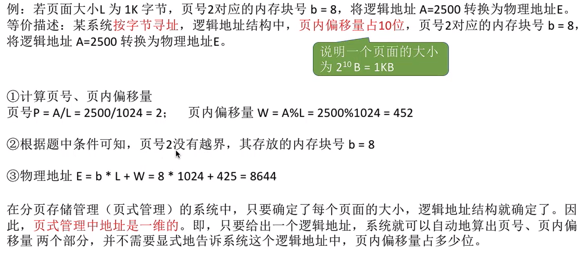
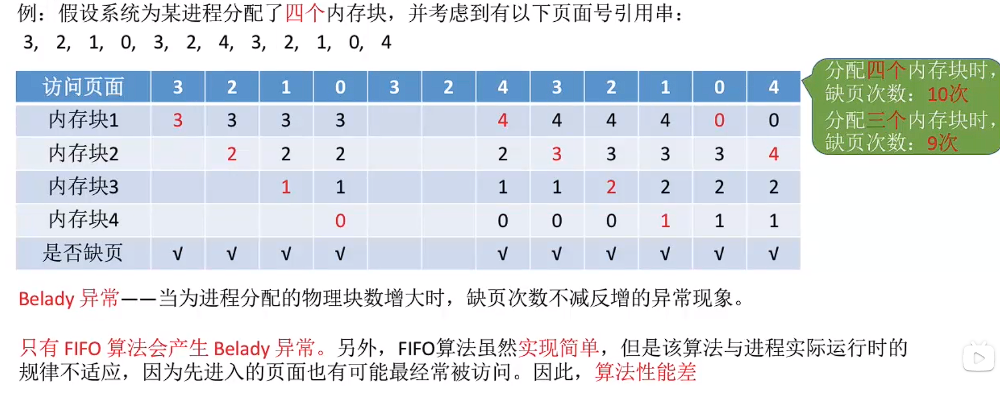
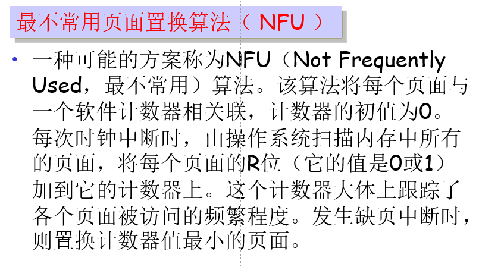
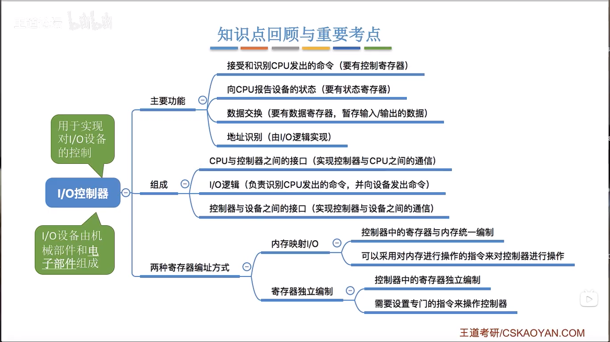

# 操作系统

## 1.11操作系统概念、功能和目标

- 概念：
  - 操作系统(Operating System,Os)是指控制和管理整个计算机系统的硬件和软件资源，并合理地组织调
    度计算机的工作和资源的分配，以提供给用户和其他软件方便的接口和环境，==它是计算机系统中最基本的系统软件==。
  - 是软件
  
- 功能
  - 
  - 
  - 系统调用=广义指令

## 1.12操作系统的特征

- ==并发==
  - 指两个或多个事件在同一时间间隔内发生。这些事件宏观上是同时发生的，但微观上是交替发生的
- ==共享==
  - 
- 虚拟
  - 空分复用技术
  - 时分复用技术
- 异步

## 1.13操作系统的发展与分类

## 1.14操作系统的运行机制与体系结构

## 1.15中断和异常

## 1.16系统调用

==陷入指令是唯一一个只能在用户态执行，而不可在核心态执行的指令==

## 2.11进程介绍

- 定义

  

  

## 2.12进程的状态与转换

上下文切换

- 将CPU切换到另一进程需要保存原来进程的状态并装入新进程的保存状态，这被称为上下文切换。上下文切换时间是额外开销，因为切换时系统并不能做什么有用的工作。上下文切换时间与硬件支持密切相关。

## 2.13进程控制

原语内容

## 2.14进程通信

共享存储：

管道通信：

消息传递：

## 2.15线程概念和多线程模式

- 进程的引入，实现了系统级的并发
  线程的引入，实现了进程级的并发

- 引入线程的目的是在进程中实现并发，减少程序并发执行所付出的时空开销,使操作系统具有更好的并发性。
- 线程的内容主要是PC，寄存器，堆栈

线程的属性：

ULT：

KLT：

- 用户级线程操作系统不知道线程的存在，线程控制不必使用系统调用，速度比较快，但是一旦进程中一个线程因为系统调用阻塞，其他线程也被阻塞。内核级线程与之相反，线程控制由操作系统完成，速度比较慢，但进程中的一个线程阻塞不影响其他线程。

## 2.21处理机调度

## 2.22进程调度的时机、切换与过程、方式

## 2.23调度算法的评价指标

## 2.24FCFS、SJF、HRRN

- 先来先服务（FCFS）
- 短作业优先（SJF）
- 高响应比优先（HRRN）

- •**R**＝响应时间 **/** **要求运行时间**

  •＝(作业等待时间＋需运行时间)/ **需运行时间**

  •＝1＋已等待时间 / **需运行时间**

  •＝1＋W/T

## 2.24调度算法

- 优先级调度算法
- 

分时操作系统

- 时间片轮转调度算法（RR调度）

时间片太大，退化为FCFS，交互性变差。时间片太小，进程切换频繁，系统开销大

- 多级反馈队列调度算法

实时操作系统：

最早截止时间优先

最低松弛度优先算法

- 松弛度＝必须完成时间－本身运行时间－当前时间

## 2.31进程同步与互斥

## 2.32进程的软件实现方法

单标志法

- 只能轮流访问
- 违背空闲让进

双标志先检查法

- 违背忙则等待

## 2.33进程的硬件实现方法

## 2.34信号量机制

## 2.35信号量机制实现进程互斥、同步

互斥：

同步：

==前操作之后执行V操作，后操作之前执行P操作==

## 2.36生产者消费者问题

==实现互斥的p操作一定要放在实现同步的p操作之后==

- V操作可以交换
- 重点是两队同步关系

~~~
empty=1
full=0
producer(){
	while(1){
	生产一个产品；
	P(empty);
	P(mutex);
	把产品放入缓冲区
	V(mutex);
	V(full);
	}
}

consumer(){
	while(1){
		P(full);
		P(mutex);
		从缓冲区取出一个产品；
		V(mutex);
		V(empty);
		使用产品；
	}
}
~~~

## 2.37多生产者-多消费者问题

 

==如果缓冲区大于1，就必须专门设置一个互斥信号量mutex来保证互斥的访问缓冲区==

- pv操作解题思路

==要从事件的角度来考虑，而不是从进程的角度来考虑==

## 2.38吸烟者问题

## 2.39读者-写者问题

  

## 2.310哲学家问题

3.

## 2.311管程

- 一种高级同步机制

 

特性：

- 封装性
- 互斥性
- 语言相关性

## 2.41死锁的概念

- 互斥条件
- 不剥夺条件
- 请求和保持条件
- 循环等待条件 
  - 循环未必死锁，死锁必然有循环等待

## 2.42预防死锁

## 2.43避免死锁

- 处于安全状态，一定不会发生死锁
- 如果进入不安全状态，就可能发生死锁

- ==银行家算法==

## 2.44死锁的检测和解除

## 3.11内存的基础知识

## 3.12内存管理的概念

## 3.13覆盖与交换

内存扩充

覆盖：

交换：

## 3.14连续分配管理方式

动态重定位的实现方法有很多，其中一种方法是在硬件上设置一个重定位寄存器，用来存放程序的基地址，然后将程序中的相对地址加上基地址得到绝对地址

- 单一连续分配

固定分区分配

动态分区分配

1. 分配所用数据结构

- 空闲分区表
- 空闲分区链

2. 动态分区分配算法
3. 如何回收
   - 回收之后发现有相邻的内存空间要进行合并

## 3.15动态分区分配算法

首次适应算法

最佳适应算法

最坏适应算法

## 3.16基本分页存储管理

 

## 3.17基本地址变换机构

- 页表寄存器PTR，存放页表的起始地址F和页表长度M
- 
- 
- 

## 3.18具有快表的地址变换机构 

- 时间局部性：如果执行了程序中的某条指令，那么不久后这条指令很有可能再次执行；如果某个数据被访问过，不久之后该数据很可能再次被访问。（因为程序中存在大量的循环）
- 空间局部性：一旦程序访问了某个存储单元，在不久之后，其附近的存储单元也很有可能被访问。（因为很多数据在内存中都是连续存放的)
- 快表，又称联想寄存器（TLB)
  - 是一种访问速度比内存快很多的高速缓冲存储器，用来存放当前访问的若干页表项，以加速地址变换的过程。与此对应，内存中的页表常称为慢表。
- 
- 

## 3.19两级页表

- 单级页表的问题

- 问题一：页表必须连续存放，因此当页表很大时，需要占用很多个连续的页框。
- 问题二：没有必要让整个页表常驻内存，因为进程在一段时间  内可能只需要访问某几个特定的页面。

## 3.110基本分段存储管理

## 3.111段页式管理方式

 

 

## 3.21虚拟内存的基本概念

传统存储管理的缺点

- 一次性：作业必须一次性全部装入内存后才能开始运行。这会造成两个问题：①作业很大时，不能全
  部装入内存，导致大作业无法运行；②当大量作业要求运行时，由于内存无法容纳所有作业，因此只
  有少量作业能运行，导致多道程序并发度下降。
- 驻留性：一旦作业被装入内存，就会一直驻留在内存中，直至作业运行结束。事实上，在一个时间段
  内，只需要访问作业的一小部分数据即可正常运行，这就导致了内存中会驻留大量的、暂时用不到的
  数据，浪费了宝贵的内存资源。

虚拟内存的定义

- 基于局部性原理，在程序装入时，可以将程序中很快会用到的部分装入内存，暂时用不到的部分留在外存，就可以让程序开始执行在程序执行过程中，当所访问的信息不在内存时，由操作系统负责将所需信息从外存调入内存，然后继续执行程序
  若内存空间不够，由操作系统负责将内存中暂时用不到的信息换出到外存
  在操作系统的管理下，在用户看来似乎有一个比实际内存大得多的内存，这就是虚拟内存  

虚拟内存的特征

- 多次性：无需在作业运行时一次性全部装入内存，而是允许被分成多次调入内存。
- 对换性：在作业运行时无需一直常驻内存，而是允许在作业运行过程中，将作业换
  入、换出。
- 虚拟性：从逻辑上扩充了内存的容量，使用户看到的内存容量，远大于实际的容量。

## 3.22请求分页存储管理

请求页表

缺页中断机构 

属于内中断中的故障

- 快表中的页面一定在内存中

## 3.23页面置换算法

最佳置换算法OPT

- 最佳置换算法(OPT,Optimal)：每次选择淘汰的页面将是以后永不使用，或者在最长时间内不再被
  访问的页面，这样可以保证最低的缺页率。 
- 现实中无法实现
- 可用作其他算法的性能评价的依据
- 

先进先出置换算法FIFO

- 先进先出置换算法(FIFO)：每次选择淘汰的页面是最早进入内存的页面
  实现方法：把调入内存的页面根据调入的先后顺序排成一个队列，需要换出页面时选择队头页面即可
  队列的最大长度取决于系统为进程分配了多少个内存块。

- 会出现belady异常
- 

第二次机会页面置换算法

- R位是访问位，M是修改位

最近最久未使用置换算法LRU(least recently used)

- 最近最久未使用置换算法(LRU,least recently used):每次淘汰的页面是最近最久未使用的页面
  实现方法：赋予每个页面对应的页表项中，用访问字段记录该页面自上次被访问以来所经历的时间t。
  当需要淘汰一个页面时，选择现有页面中t值最大的，即最近最久未使用的页面。
- 算法性能好开销大
- 

时钟置换算法CLOCK或最近未用算法NRU

- 性能和开销较均衡
- 

改进型的时钟置换算法

- 加入一个修改位
- 
- 

最不常用页面置换算法（NFU）

老化算法

工作集页面置换算法

- 每个表项至少包含两条信息：上次使用该页面的近似时间和R（访问）位。
- 在处理每个表项时，都需要检查R位。如果它是1，就把当前实际时间写进页表项的“上次使用时间”域，以表示缺页中断发生时该页面正在被使用。
-  如果R是0，那么表示在当前时钟滴答中，该页面还没有被访问过，然后与t做比较。如果它的生存时间大于t，那么这个页面就不在工作集中，而用新的页面置换它。
- 如果R是0，但是生存时间小于等于t，那么该页面应该留在工作集中。并记录下生存时间最长的页面。如果整个表中都没有适合淘汰的页面，只能淘汰生存时间最长的页面。

## 3.24页面分配策略

- 驻留集：指请求分页存储管理中给进程分配的物理块的集合
  - 若驻留集太小，会导致缺页频繁，系统要花大量的时间来处理缺页，实际用于进程推进的时间很少：
  - 驻留集太大，又会导致多道程序并发度下降，资源利用率降低。所以应该选择一个合适的驻留集大小。
  - 固定分配：操作系统为每个进程分配一组固定数目的物理块，在进程运行期间不再改变。即，驻留集
    大小不变
  - 可变分配：先为每个进程分配一定数目的物理块，在进程运行期间，可根据情况做适当的增加或减少。
    即，驻留集大小可变
  - 局部置换：发生缺页时只能选进程自己的物理块进行置换。
  - 全局置换：可以将操作系统保留的空闲物理块分配给缺页进程，也可以将别的进程持有的物理块置换
    到外存，再分配给缺页进程。
  - 
  - 可变分配全局置换：只要缺页就给分配新物理块
    可变分配局部置换：要根据发生缺页的频率来动态地增加或减少进程的物理块
- 何时调入页面
  - 预调页策略：一次调入多个页面，主要用于进程的首次调入（运行前调入）
  - 请求调页策略：进程在运行期间发现缺页时才调入（运行时调入），I/O开销大
- 从何处调入
  - 
- 抖动（颠簸）现象
  - 主要原因是分配给进程的物理块不够 
- 工作集：在某段时间间隔内，进程实际访问页面的集合
- 

### 倒排页表

- **物理内存的每一个页帧有一个表项**
- **例如建立一张与物理页帧数相仿的哈希表，对虚拟地址进行散列。所有散列值一样的虚拟页面被链接在一起**
- 如果表项数量相同，则倒排页表地址映射更慢，因为页表是用页号索引可以迅速找到匹配项，而倒排页表的页面号不是有序的，必须顺序进行查找。

系统出于对多进程的支持，实际转换关系是 进程号（process id， PID） + 虚拟页号（virtual page number， VPN） + 页内偏移（offset）---> 物理页框（physical page number，PPN） + 页内偏移（offset）

## 3.25内存映射文件

方便程序员对文件进行操作

如果一个程序为多个进程所共享,那么该程序的代码在执行的过程中不能被修改,程序是可重入码

## 4.11文件管理

 

## 4.12文件的逻辑结构

## 4.13文件目录

文件控制块FCB

- 最重要的文件名和文件的物理地址

目录结构

- 树形结构不利于实现文件的共享

## 4.14文件的物理结构

- FAT（文件分配表）
  - 常驻内存
  - 可随机访问

- 默认隐式分配
- FAT是每个磁盘对应一张
- [(22条消息) FAT磁盘分配策略简说_DrCrypto的博客-CSDN博客](https://blog.csdn.net/u011240016/article/details/52871758)

索引分配：

- 
- 
- 

索引节点有13个地址项是什么意思

- 在UNIX系统中，每个文件都有一个对应的索引节点（inode），它记录了文件的所有属性信息以及文件数据在磁盘上的存储位置。其中包括13个地址项，每个地址项都可以存储一个盘块的地址，用于指示文件数据在磁盘上的存储位置。因此，一个文件最多可以占用13个盘块。当文件大小超过13个盘块时，需要使用间接索引技术来访问更多的盘块。

inode

- 目录文件的结构非常简单，就是一系列目录项（dirent）的列表。每个目录项，由两部分组成：所包含文件的文件名，以及该文件名对应的inode号码。
- 目录项：包括文件名和inode节点号。
- Inode：又称文件索引节点，包含文件的基础信息以及数据块的指针。
- 数据块：包含文件的具体内容。
- 引入i-node后，如果一个文件目录占用磁盘块m块，那么查找一个文件的属性需要平均打开（m+1）/2 +1次盘块。

==十分重要！！！==

## 4.15逻辑结构与顺序结构

## 4.15文件存储空间管理

空闲表法

空闲链表法

==位示图法==

用01代表盘块是否已分配

成组链接法

 

 

文件的一致性

- 块的一致性检查
  - 在检查块的一致性时，程序构造两张表，每张表为每个块设立一个计数器。表1跟踪使用的块，表2追踪空闲块。
- 文件的一致性检查
  - 构造一张文件计数器表。程序从根目录开始沿着目录树递归下降，检查文件系统中的每个目录。对每个目录中的每个文件，将文件使用计数加1。由于存在硬链接，文件可以出现在多个目录中。检验程序完成后将得到一张i节点索引的表，表明每个文件被多少目录包含。
  - 用表中的计数与i节点中的链接计数比对，如果文件一致，则计数应该相等。
  - 目录项大于 count 时，count-0 时，文件被删除，但是依然有目录项指向 inode，而这个inode 可能已经被别的文件使用了
    目录项小于 count 时，即使删除了所有指向这个文件 inode 的目录项，count 依然大于0，所以 inode 号和 block 都继续被占用。

## 4.17文件的基本操作

创建

删除

打开

## 4.18文件共享

- •**硬链接文件有两个限制****:**

  –1、不允许给目录创建硬链接；

  –2、只有在同一文件系统中的文件之间才能创建链接。

  •**软连接指向的是路径****(path),****可以是任意文件或目录，还可以链接不同文件系统的文件。**

## 4.19文件保护

##  4.20文件系统

层次结构 

全局结构

每个文件系统对应的是每个磁盘分区

## 4.21虚拟文件系统

## 5.11I/O设备的概念和分类

## 5.12I/O控制器

 

## 5.13I/O控制方式

- I/O通道是一种特殊的处理机。它具有执行I/O指令的能力，并通过执行通道(I/O)程序来控制I/O操作。但I/O通道又与一般的处理机不同： 
  指令类型单一，局限于与I/O操作有关的指令； 
  通道没有自己的内存，通道所执行的通道程序是放在主机的内存中的。 

- 通道又被称为I/O处理器,它用于实现(主存与外设)之间的信息传输。（类似DMA

- **通道的分类**

  –字节多路通道

  - 字节多路通道:这种通道可以连接多台慢速I/O设备

  –数组选择通道

  - 这种通道可以连接多台快速I/O设备，但每次只能从中选择一台设备执行通道程序，进行主存与该设备之间的数据传送

  –数组多路通道

程序直接控制方式

中断驱动方式

DMA方式

通道控制方式

## 5.14I/O软件层次结构

用户层软件

 

设备独立性软件

设备驱动程序

中断处理程序

## 5.15输入输出应用程序接口和驱动程序

## 5.21 I/O核心子系统

 

## 5.22 假脱机技术（SPOOLing技术）

“脱机”——脱离主机的控制进行的输入/输出操作

特点

- (1)提高了I/O速度.从对低速I/O设备进行的I/O操作变为对输入井或输出井的操作,如同脱机操作一样,提高了I/O速度,缓和了CPU与低速I/O设备速度不匹配的矛盾.
  (2)设备并没有分配给任何进程.在输入井或输出井中,分配给进程的是一存储区和建立一张I/O请求表.
  (3)将独占设备改造为共享设备。实现了虚拟设备功能。 

## 5.23 设备的分配与回收

设备分配时考虑的因素

- 固有属性
  - 

- 设备分配的安全性
  - 
- 设备分配算法

设备控制表（DCT)

控制器控制表（COCT）

通道控制表（CHCT）

系统设备表（SDT）

设备分配步骤

## 5.24 缓冲区管理

单缓冲

 

 

双缓冲

循环缓冲区

缓冲池

## 5.31磁盘的结构

## 5.32磁盘调度算法

==重要高频考点==

先来先服务算法FCFS

最短寻找时间优先（SSTF）

扫描算法

LOOK调度算法

循环扫描算法

C-LOOK算法

## 5.33减少磁盘延迟时间的方法

## 5.34磁盘管理

 磁盘初始化

引导块

 

## 5.35固态硬盘SSD

   

## 习题 

- 1.在计算机上配置操作系统的作用有哪几个？

  - 作为资源的管理者，可以进行处理机管理，存储管理，文件管理和设备管理
  - 向用户提供服务，可以提供命令接口和程序化接口，GUI用户图形界面
  - 扩展硬件，对计算机资源的抽象

  2.OS与硬件、其他系统软件、软件、用户的关系是什么？

  - 操作系统是覆盖在硬件上的第一层软件，他管理计算机的硬件和软件资源，并向用户提供良好的界面。
  - 操作系统与硬件密切相关，他直接管理着硬件资源，为用户完成所有与硬件相关的操作
  - 操作系统是核心的系统软件，其它系统软件运行在操作系统的基础之上，是其它系统软件与硬件之间的接口
  - 用户使用计算机除了需要操作系统支持以外，还需要用到其他系统软件和应用软件。3.OS的特征有哪些？它们有何关系？

  4.为什么OS具有异步性特征?

  - 异步性是并发性和共享性的必然结果。OS允许多个并发进程共享资源、相互合作，使得每个进程的运行过程受到了其他进程的制约，不再“一气呵成”，这必然会导致异步这一特征的产生。

  5.进程是执行中的程序，这个执行是代码在CPU上执行吗，为什么？

  6.描述一下进程的三种基本状态分别是什么含义？在一个分时系统中，这几种状态是如何转化的？

  7.•**对分时系统和实时系统进行比较。（多路性，独立性，及时性，交互性，可靠性）**

  - 分时系统和实时系统是两种不同的操作系统。分时系统是设计成一个多用户的通用系统，交互能力强；而实时系统大都是专用系统。¹² 

    分时系统的多路性强，可以同时为多个终端用户服务，交互性强；而实时系统的多路性则主要表现在经常对多路的现场信息进行采集及对多个对象或多个执行机构进行控制。²

    分时系统的独立性较差，因为它需要与其他用户共享计算机资源；而实时系统则具有较高的独立性，因为它是专用于某些特定任务的。²

    分时系统和实时系统都需要及时响应请求，但实时系统对响应时间的敏感程度更高。¹²

    分时系统和实时系统都需要保证可靠性，但实时系统对可靠性的要求更高。¹²

- 什么是多道程序设计技术？它的特点是什么？ 

  - 多道程序设计技术是在计算机内存中同时存放几道相互独立的程序，使它们在管理程序控制下，相互穿插运行，两个或两个以上程序在计算机系统中同处于开始到结束之间的状态，这些程序共享计算机系统资源。¹² 

    多道程序设计技术的特点是：¹²

    - 多道性：多个程序同时进入内存并共享计算机系统资源。
    - 并发性：多个程序同时运行。
    - 独立性：每个程序都是独立的，不受其他程序的影响。
    - 异步性：每个程序的执行速度不同，不同程序之间的执行顺序不确定。
    - 交换性：当一个程序等待某种事件发生时，操作系统可以暂停该程序的执行，并把处理器分配给其他程序。

- 缺页中断与一般中断的区别是什么

  - 缺页中断和一般中断的区别是：缺页中断是一种特殊的中断，它与一般的中断的区别是：
  - （1）在指令执行期间产生和处理中断信号，CPU通常在一条指令执行完后检查是否有中断请求，而缺页中断是在指令执行时间，发现所要访问的指令或数据不在内存时产生和处理的。 
  - （2）一条指令在执行期间可能产生多次缺页中断。¹²³

- •**内存管理中**“内碎片”和“外碎片”各指什么？在固定分区分配，可变分区分配，页式虚拟存储系统，段式虚拟存储系统中存在何种碎片？为什么？

  - 内存管理中，“内碎片”和“外碎片”分别指的是：内碎片是指已分配的内存空间中，由于分配的块长大于所需的块而浪费的空间；外碎片是指已分配的内存空间中，未被使用且太小而无法分配给新的进程的空闲空间。¹²³

    在固定分区分配中，由于每个进程都有一个固定大小的分区，因此会产生内部碎片；在可变分区分配中，由于进程大小不同，因此会产生外部碎片；在页式虚拟存储系统中，由于每个进程所需的页数不同，因此会产生内部碎片；在段式虚拟存储系统中，由于每个进程所需的段大小不同，因此会产生外部碎片。¹²³

- B

- C
  - 

- 

  - 

- 2）UNIX系统采用直接、一级、二级、三级间接索引技术访问文件，其索引节点有13个地址项。如果每个盘块的大小为1KB，每个盘块号占4B。

  （1）进程A访问文件F的11264字节需要使用直接地址或几级间接索引？

  答：逻辑块号=11264/1024=11，直接地址是0~9，所以用一级索引

  （2）当访问到逻辑盘块多少号时开始启用一级间接索引？二级和三级呢？

  答：1K/4B=256，每一个索引块指向256个块

  直接地址：10块，0~9

  一级索引：256块 10~265   256+10-1

  二级索引：2562块 266~65801 2562+256+10-1

  三级索引：2563块 65802~16843017  2563+2562+256+10-1

- 假设文件目录使用inode方式，根目录在某个固定盘块，且每个子目录只能使用一个磁盘块，在/usr/lee 目录下存在一个符号链接文件f，f内容是"../zhang/a.txt"(假设符号链接允许用相对路径),打开这个文件需要打开多少盘块？
  答：13个盘块。（1+6*2）（根目录只有一层

 
