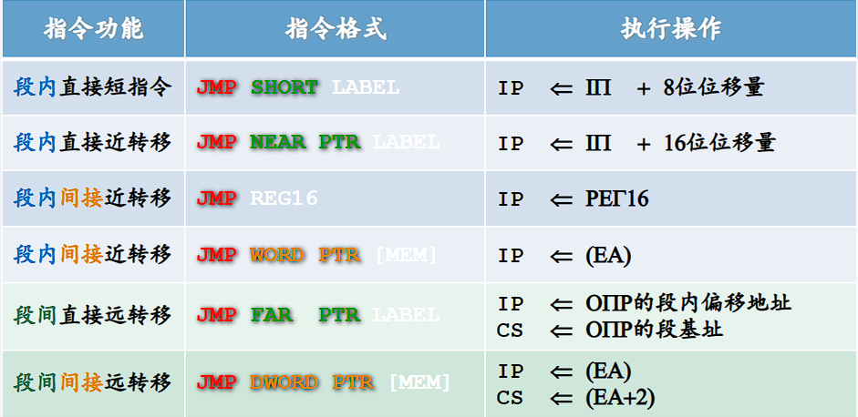
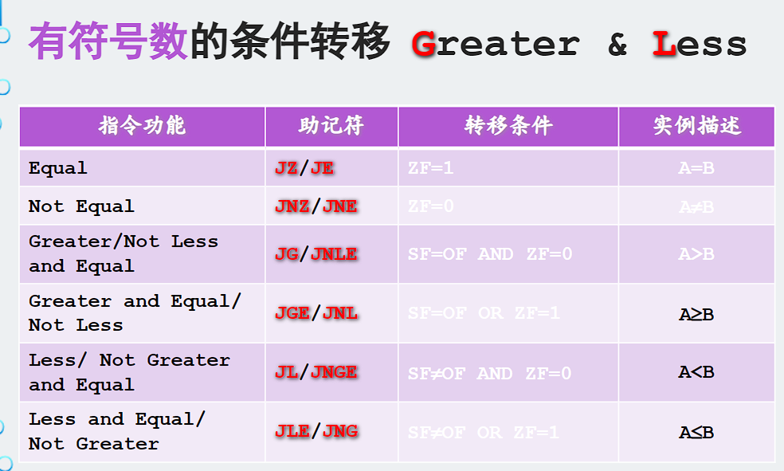
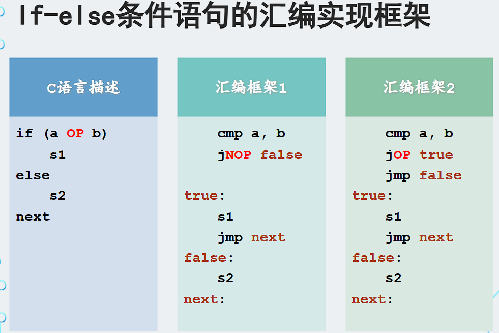

# 汇编语言

## 第一章基础知识

- CPU对数据的读写：

  - 地址信息
  - 控制信息:控制总线的宽度决定了CPU对外部器件的控制能力。
  - 数据信息

- 汇编语言由3类指令组成。

  - 汇编指令
  - 伪指令：没有对应的机器码，由编译器执行，计算机并不执行
  - 其他符号：如+、-、*、/等，由编译器识别，没有对应的机器码。

- 随机存储器（RAM）在程序的执行过程中可读可写，必须带电存储

  只读存储器（ROM）在程序的执行过程中只读，关机数据不丢失

- CPU将系统中各类存储器看作一个逻辑存储器

## 第二章 寄存器

- 8086CPU加电启动或复位后CS=FFFFH,IP=0000H
- DEBUG
  - r：查看、改变CPU寄存器的内容
    - r ax可以修改寄存器的值
  - d：查看内存中的内容
    - d 1000:0
  - e 1000:0
    - 改写内存中的值
  - u：将机器指令翻译成汇编指令
    - u 1000:0
  - t：执行一条机器指令
  - a：以汇编指令形式向内存中写入指令
    - a 1000:0
  - q:退出debug
  - p
    - 要使用p指令执行int21
    - 遇到loop时，用p执行
  - g
    - g 0012
    - 程序执行到CS:0012

## 第三章 寄存器（内存访问）

- 自动取ds中的数据为内存单元的段地址
- 不能直接将数据送入段寄存器
- 段寄存器不可在算术指令中
- 低地址存低位寄存器，高地址存高位寄存器
- SS：SP指向栈顶元素
- push ax
  - sp=sp-2
  - 将ax存入ss:sp
- pop ax
  - ss:sp送入ax
  - sp=sp+2
- 一个栈段最大64KB,因为SP只有16位，2^16

## 第四章 第一个程序

- Debug中T命令在执行修改SS的指令时，下一条指令也紧接着执行
  - SS：SP联合指向栈顶，而对它们的设置应该连续完成。如果在执行完设置SS的指令后，CPU相应中断，引发中断过程，要在栈中压入标志寄存器、CS和IP的值。而SS改变，SP并未改变，SS：SP指向的不是正确的栈顶，将引发错误。所以CPU在执行完设置SS的指令后，并不响应中断。这给连续设置SS、SP的指向正确的栈顶提供了一个时机
- 程序结束
  - `mov ax,4c00H`
  - `int 21H`（要使用p指令执行int21)
- assume
  - `assume cs:codesg`将codesg代码段与cs寄存器关联起来
  - 除了cs可以自动分配，其它的都要赋值

## 第五章 [bx],loop

- idata表示常量,==数据不能以字母开头==`mov ax,0ffffh`
- loop
  - (cx)=(cx)-1
  - if(cx==0)
- 写程序时要考虑
  1. 数据类型是否匹配
  2. 结果是否越界
- [idata]
  - debug解释为内存单元
  - masm编译器解释为idata数据
- 段前缀
  - cs,ds,ss,es
- 安全空间
  - 0:200~0:2ff

## 第六章 包含多个段的程序

~~~
data segment
val1 db 12H,8eh
data ends
assume cs:code
code segment
//数据
start:
//代码
code ends
end start
~~~

- `dw 16 DUP(0)`定义16个字形0
- 在8086cpu中一个段的容量不能超过64KB
- `assume cs:code,ds:data,ss:stack`

## 第七章

- and与运算
- or或运算
- 大小写转换
  - ‘A’:41H，‘a’:61H
  - `and al,11011111B`转大写
  - `or al,00100000B`转小写
- [bx+idata]
  - `mov ax,[200+bx]`
  - `mov ax,200[bx]`
  - `mov ax,[bx].200`
- SI和DI
  - ==不能分成两个8位寄存器==
  - 功能类似于bx，默认段寄存器为ds
- 二重循环需要保存cx

## 第八章

- reg:ax,bx,cx,dx,ah,al,bh,bl,ch,cl,dh,dl,sp,bp,si,di
- sreg:ds,ss,cs,es

bx、si、di、bp

- 组合只能是[bx+si],[bx+di],[bp+si],[bp+di]
- `b_+_i`
- bp的默认寄存器是ss

内存可以存储在

- cpu内部（如寄存器
- 内存
- 端口

寻址方式

- `mov ax,2000h`立即寻址
- `mov ax,bx`寄存器寻址

- [idata]直接寻址
- [bx]寄存器间接寻址
- [bx+idata]寄存器相对寻址
- [bx+di]基址变址寻址
- [bx+di+idata]相对基址变址寻址

数据长度

- `mov byte ptr [bx]`
- `mov word ptr [bx]`
- push指令只支持字操作

div指令

- 除数放在reg或内存单元中
- 被除数：默认ax或dx和ax（dx高位，ax低位
- 结果：al放商，ah放余数，相应的ax放商，dx放余数

dup

- `dd 3 dup(0)`相当于dd 0,0,0

## 第九章 转移指令的原理

转移行为

- 段内转移
  - 只修改IP`jmp ax`

- 段间转移
  - 同时修改CS和IP`jmp 1000:0`

- 短转移
  - 转移范围为-128~127

- 近转移
  - -32768~32767

  

offset

- 取得标号的偏移地址
- `mov ax,offset start`

jmp

- 有标号的是直接转移，没有的是间接转移
- `jmp short s`段内短转移
- `jmp near ptr s`段内近转移==注意有ptr！！！==
- `jmp far prt s`段间转移（又称远转移
- 高字段地址，低字段偏移地址
- 不需要转移的目的地址，只要知道相对地址即可
- 机器码为`EB__`(__中的是位移的补码)

jcxz

- if((cx)==0)jmp short 标号；
- 所有的有条件转移指令都是短转移
- -128~127

loop

- 所有的循环指令都是短指令
- -128~127
- (cx)--;if((cx!=0))jmp short 标号；

## 第十章call和ret

- ret用栈中的数据修改IP
- retf用栈修改CS和IP

call 标号

- 将IP或CS和IP压栈
- jmp near prt 标号
- ==不能实现短转移==

call far ptr 

- push CS
- push IP
- jmp far ptr 标号

call 16位reg

call word ptr 内存单元

call dword ptr 内存单元

子程序

- ~~~
  assume cs:code
  code segment
  main:
  	call s
  	mov ax,4c00h
  	int 21h
  s:	
  	ret
  ~~~

mul

- 8位默认在al，16位默认在ax
- 结果默认在ax，16位则高位dx，低位ax

dup

- `db 3 dup(0)`
- `dw 5 dup(1,2,3)`

## 第十一章标志寄存器

ZF

- 零标志位
- 结果为0则1
- 为1则0

- 逻辑和算术运算会改变标志寄存器
- mov、push、pop等传送指令不会改变标志寄存器

PF

- 奇偶标志位

- 1的个数为偶数则1
- 1的个数为奇数则0

SF

- 符号标志位

- 结果为负则1
- 结果为正则0
- 对无符号数没有意义

CF

- 进位标志位
- 对于无符号数
- 进位或借位则1

OF

- 溢出标志位
- 对于有符号数
- 溢出则1

AF

- 辅助进位标志位
- 表示第四位向高四位有进位

adc

- add+cf

sbb

- sub-CF

cmp

- 不保存结果的sub
- CMP和XCHG的两个操作数不能同时为内存中的数据，但可以一个是寄存器，一个是内存数据
- `cmp ah,bh`
  - sf=1,of=0,未溢出，结果为负说明ah<bh
  - sf=1,of=1,溢出导致负，真正结果为正，则ah>bh
  - sf=0,of=1,溢出导致正，真正结果为负，则ah<bh
  - sf=0,of=0,未溢出，结果为正，ah>bh

条件转移指令

- 范围都是[-128,127]
- 都是短转移

无符号数条件转移指令

| 指令 |     含义     | 检测的相关标志位 |
| :--: | :----------: | :--------------: |
|  je  |  等于则转移  |       zf=1       |
| jne  | 不等于则转移 |       zf=0       |
|  jb  |  低于则转移  |       cf=1       |
| jnb  | 不低于则转移 |   cf=0 or zf=1   |
|  ja  |  高于则转移  |       cf=0       |
| jna  | 不高于则转移 |   cf=1 or zf=1   |

DF

- df=0,每次操作后si,di递增
- df=1,每次操作后si,di递减

movsb

- `mov es:[di],byte ptr ds:[si]`
- df=0则`inc si ;inc di`
- df=1则`dec si ;dec di`

movsw

- 传送一个字

`rep movsb`

- 相当于
- `s:movsw`
- `loop s`
- cld设置df=0递增
- std设置df=1递减

## 第十二章中断

- 0000:0000到0000:03FF中存放中断向量表

- 中断类型码从0开始

中断过程

- 取得中断类型码n
- pushf
- tf=0,if=0
- push cs
- push ip
- ip=n*4
- cs=n*4+2

iret

- pop ip
- pop cs
- popf

IF

- 表示能否被其它中断打断

TF

- 1则产生单步中断

## 第十四章端口

- 0~65535
- 最多64KB

cpu可以直接访问

- 内存寄存器
- 内存单元
- 端口

in和out

- 8位端口用al
- 16位端口用ax
- in是读入
- out是写入

shl

- 逻辑移位指令
- 将寄存器或内存单元的数据向左移位
- 最后移出的写入CF
- 其它的用0补充

## 反码与补码

- 正数的反码与补码是自己本身
- 最高位为1，表示负数
- 负数的补码为其绝对值取反加1
- 正数的补码取反加1为其相对应的负数
- 8位补码表示范围为-128~127

## 注意

- 注意是十进制还是十六进制
- pusha通用寄存器压栈
- popa通用寄存器出栈
- `NOT`指令不影响标志位
- SAL reg/mem,1/CL      	(Shift Arithmetic Left)
  						；算术左移，最高位进入CF，最低位补0 (同SHL)
  SAR reg/mem,1/CL      	(Shift Arithmetic Right) 
  						；算术右移，最低位进入CF，最高位不变(保证符号位不变)
  						；SAR也是右移，只不过一直用原来符号位的数来补
- ROL reg/mem,1/CL  	；(Rotate Left)  不带进位循环左移
  ROR reg/mem,1/CL  	；(Rotate Right) 不带进位循环右移
- RCL reg/mem,1/CL  	；(Rotate Carry Left)  带进位循环左移 相当于是和CF一起，9位一起进行循环移位
  RCR reg/mem,1/CL  	；(Rotate Carry Right) 带进位循环右移

~~~c
for(i=0;i<len-1;i++)
    	for(j=0;j<len-1-i;j++)
            
for(cx=len-1;cx!=0;cx--)
    for(bx=cx,si=0;si!=bx;si++ )
~~~

