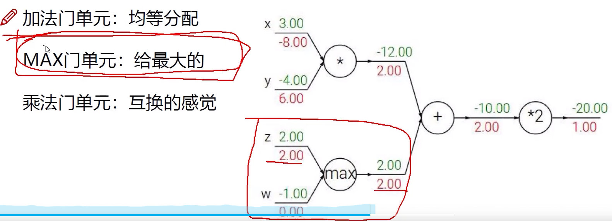
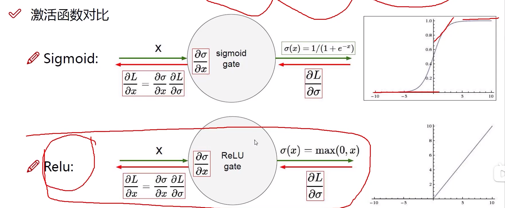

# 深度学习

- 重点在于提取特征 
- 常规套路
  - 收集数据定标签
  - 训练分类器
  - 测试，评估

## 神经网络基础

### 线性函数

W:函数权重参数

b：微调参数

### 损失函数

损失函数=数据损失+正则化惩罚项

### Softmax分类器

### 前向传播和反向传播

反向：逐层传播

## 神经网络

过拟合是指在验证数据上模型的准确性将达到峰值，**然后停滞或开始下降**。

- 正则化的影响
  - 惩罚力度越高，越趋于平缓
- 激活函数

现在主要使用Relu,不用Sigmoid是由于会有梯度消失

- 数据预处理

- 参数初始化

Drop-out

防止网络模型太复杂

## 卷积神经网络CNN

- 整体架构

- 卷积的作用
  - 将图像分割为小块通过权数参数矩阵得到每个小块的特征值

计算过程：将各个深度的输入分块与不同Filter相内积在相加得到特征值（可以用多个Filter来执行

- 步长
  - 
  - 常见为1
- 卷积核尺寸
  - 常为3*3