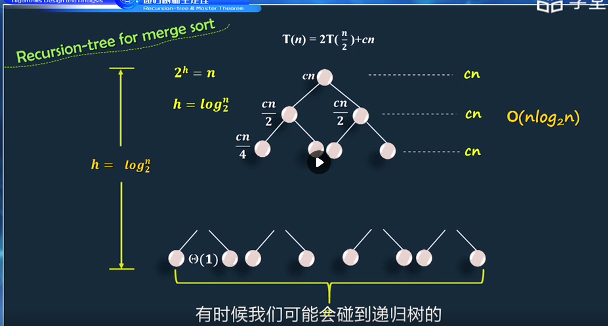

# 算法设计与分析

## 绪论

算法是求解问题的一系列计算步骤

算法的重要特性

- 有限性
- 确定性
- 可行性
- 输入性
- 输出性

渐进符号

- 渐进上界记号：O
- 渐进下界符号：Ω
- 渐进紧确界记号：Θ

递归树

- 将各层确定的结点时间总和相加

- 

- 递归速度不同时，以最长的为主

主方法

- $$
  T(n)=aT(n/b)+f(n)
  $$

- 先比较f(n)和n^(logba)的大小

- 哪个大，T(n)=哪个

- 若相等，T(n)=O(n^(logba)*log2n)

图灵机

- 输入带
- 读写头
- 有限状态自动机

一个语言是可计算的，当且仅当为递归语言

具有多项式时间的算法就为好算法

一个图灵机并不是对任何输入都能停机

P类问题：用确定性图灵机以多项式时间界可解的问题

- 最短路径判定问题
- 排序判定问题

NP问题：用非确定性图灵机以多项式时间界可解的问题，可以在多项式时间内验证算法是否正确

- 旅行商问题，图的填色问题，背包问题

NPC 问题不一定是个NP问题，只要保证所有的NP问题都可以约化到它即可


概率算法：随机化算法

- 数值概率算法：特点是用于数值的求解，得到最优化问题的近似解
- 蒙特卡洛算法：特点是判定问题的准确解，得到的解不一定正确
- 拉斯维加斯算法：特点是不一定会得到解，但是得到的解一定是正确解
- 舍伍德算法：特点是总能求得一个解，且一定是正确解

近似算法

- 通常与NP问题有关
- 不能保证得到最优解

## 概念

- 最优性原理：整个问题的最优解由各个子问题的最优解构成
- 无后效性：某状态以后的过程不会影响以前的状态，只与当前状态有关
- 有重叠子问题：子问题直接不独立
- 最优度量标准（贪心准则）：添加新的解分量形成的部分解不违反可行解约束条件
- 贪心选择性质：所求问题的整体最优解可以通过一系列局部最优解来达到
- 活结点：自已已生成但其孩子结点没有全部生成的结点
- 死结点：其孩子结点均已产生的结点
- 扩展结点：正在产生孩子结点的结点

## 分治法

### 算法框架

~~~c++
divide-and-conquer(P)
{
	if |P|<=n0 return adhoc(P);//递归出口
    divide P into P1,P2,...,Pk;//分解
    for i=1 :k
        yi = divide-and-conquer(Pi);//非递归运算
    return merge(y1,y2,...,yk);
}
~~~

### 问题特征及设计特点

问题特征

- 原问题可以划分或约归为规模较小的子问题
  - 子问题与原问题具有相同的性质
  - 子问题的求解彼此独立
  - 划分时子问题的规模尽可能均匀

- 子问题规模足够小时可直接求解
- 子问题的解综合得到原问题的解
- 各个子问题是相互独立的

算法实现：迭代或递归


主定理求解$\varepsilon$需要满足条件


### 算法改进


- 子问题不独立
- 子问题不相似
- 采用平衡思想划分子问题

### 举例

- 求最大和次大元素
  - T(1)=T(2)=1

  - T(n)=2T(n/2)+1

  - T(n)=O(n)

  - ~~~
    slove(a[],low,high,max1,max2)
    输入：数组a
    输出：最大max1和次大max2
    1.若a的个数为1,max1=a[max],max2=负无穷
    2.若a的个数为2，直接进行比较，max1为较大值，max2为较小值
    3.若a的个数为其它，取a个数的中值mid将a划分为al和ar
    4.slove(al,low,mid,lmax1,lmax2)
    5.slove(ar,mid+1,high,rmax1,rmax2)
    6.比较lmax1,rmax1,lmax2,rmax2可得max1,max2
    ~~~

- 求解第k小的数
  - T(n)= T(n/2)+O(n)

  - T(n)=O(n)

  - ~~~
    QuickSelect(a[],s,t,k)
    输入：数组a,s,t为数组的首和尾
    输出：第k小的数的值
    1.若区间a只有一个元素且为a[k-1]，则返回a[k-1]的值
    2.若a中有两个以上的元素，取区间的第一个记录作为基准tmp，从区间两端交替向中间扫描直到同一个值，i=s,j=t
    3.从右向左扫描，将小于tmp的值移动到a[i],i++
    4.从左往右扫描，将大于tmp的值移动到a[j],j--
    5.如果k-1==i则返回a[i],否则
    6.在左区间中递归查找QuickSelect(a,s,i-1,k)
    7.在右区间中递归查找QuickSelect(a,i+1,t,k)
    ~~~

- 数列最大连续子序列和
  - 子问题不独立

  - T(n)=2T(n/2)+n

  - T(n)=O(nlog(2)(n))

  - ~~~
    maxSubSum(a[],left,right)
    输入：数组a，left和right表示数组的左右边界
    输出：最大连续子序列和
    1.若a中只有一个元素，该元素大于0则返回，否则返回0
    2.取中间位置mid=(left+right)/2
    3.maxl=maxSubSum(a,left,mid);
    4.maxr=maxSubSum(a,mid+1,right);
    5.maxlb=左边加上a[mid]元素构成的序列的最大和
    6.maxrb=右边元素构成的序列最大和
    7.max=max3(maxl,maxr,maxlb+maxrb)//判断得出三者中的最大值
    ~~~

- 棋盘覆盖
  - 子问题不相似
  - T(k)=1
  - T(k)=4T(k-1)
  - T(k)=O(4^k)

- 求解大整数乘法问题

  - T(n)=O(1)  //n=1
  - T(n)=4T(n/2)+O(n)
  - T(n)=O(n^2)

- 矩阵乘法

  - T(1)=1
  - T(n)=7T(n/2)+O(n^2)
  - T(n)=n^log(2)(7)

- 并行计算

  - 将分离的工作给多处理机运行
  - 快速排序的并行算法
    - T(n)=O(n)

- 平面点对

  - 
  - 
  - 每侧最多只有六个点
  - 优化：在递归前，对坐标进行排序，作为预处理
  - 优化后T(n)=O(nlogn)

- 芯片测试

  - 问题
    - 有n片芯片，其中好芯片比坏芯片至少多1片，现需要通过测试从中找出1片好芯片。测试方法是:将2片芯片放到测试台上，2片芯片互相测试并报告测试结果:“好”或者“坏”。假设好芯片的报告是正确的，坏芯片的报告是不可靠的 (即对于被测试的芯片显示的报告可能是坏或者好）。请设计一个算法，使用最少的测试次数来找出1片好芯片。

  - [(22条消息) 分治算法：芯片检测问题_WorkHaH的博客-CSDN博客](https://blog.csdn.net/weixin_45920385/article/details/109296265)

- BSP模型

  - 整体同步并行
  - 计算
  - 通信
  - 同步
  - 总的执行时间等于各超步执行时间之和
  - 


## 动态规划


- 重要的是递推公式，当前子问题的解由上一次子问题的解推出
- 使用备忘录方法避免大量重复计算（自顶向下），动态规划一般是自底向上
- 动态规划法的基本思路是将待求解问题分解成若干个子问题，先求子问题的解，然后从这些子问题的解得到原问题的解。
- 三个基本要素
  - 最优子结构性质
  - 无后效性
  - 重叠子问题性质


### 举例

最长公共子序列问题

- ~~~
  LCSlength(X,Y)
  输入：两个字符序列X,Y,长度为m,n
  输出：最长公共子序列及其长度
  1.if(i==0||j==0)dp[m][n]=0,b[i,j]表示数据的读取方向
  2.for i=1 to m
  	for j=1 to n
  	if xi==yi
  		dp[i][j]=dp[i-1,j-1]+1
  		b[i,j]="左上"
      elseif dp[i-1][j]>=dp[i][j-1]
      	dp[i][j]=dp[i-1][j]
      	b[i,j]="上"
      else dp[i][j]=dp[i][j-1]
      	b[i][j]="左"
  return dp and b
  3.PrintLCS(b,X,i=m,j=n)
  	if i==0or j==0
  		return 
  	if b[i,j]="左上"
  		PrintLCS(b,X,i-1,j-1)
  		print xi
      elseif b[i,j]="上"
      	PrintLCS(b,X,i-1,j)
      else PrintLCS(b,X,i,j-1)
  ~~~

  - T(n)=O(mn)

- 0/1背包，完全背包

  - ~~~
    Knap(n,W,w[],v[],dp[],x[])
    输入：n为物品数量，W为最大限制重量，w表示每个物品的重量，v表示物品价值，dp表示动态规划过程，x表示是否选择物品
    输出：选择的物品及最大价值
    1.初始化dp,for i=1 to n ,dp[i][0]=0,dp[0][i]=0//dp[i][r]表示考虑第i各物品时的剩余容量为r
    2.进行状态转移
    for i=1 to n
    	for r=1 to W
    		if(w[i]>r)
    			dp[i][r]=dp[i-1][r]
            else 
            	dp[i][r]=max(dp[i-1][r],dp[i-1][r-W[i]]+v[i])当选择第i件物品时x[i]=1
    3.输出，dp[i][r]为最优价值，通过x[i]=1可得到具体所选择的物品
    ~~~

  - ~~~
    fk[i][j]表示在不超过j的重量下，第i个物品取多少个
    2.进行状态转移
    for i=1 to n
    	for r=1 to W
    		从0开始取k个第i的物品，直到超出W为止
    		dp[i][j]=dp[i-1][j-k*w[i]]+k*v[i]
    		fk[i][j]=k
    3.输出，dp[i][r]为最大价值，通过fk可得到选取的具体的物品数
    ~~~

- 求解资源分配问题

  - ~~~
    Plan(n,m,v,dp,pnum)
    输入：n表示总员工数，m表示商店类型，v表示价值数组，dp[i][s]表示在考虑商店i到m总共分配s个人后的最优盈利,pnum[i][s]表示第i个商店分配多少人
    输出：最优盈利以及各商店分配的员工数
    1.dp初始化
    dp[0][j]=0,dp[i][0]=0
    2.进行状态转移
    for i=1 to m
    	for j=1 to n
    		for s=0 to n
    			dp[i][j]=max(dp[i-1][j-s]+v[i][s])
    			punm[i][j]=s
    3.输出，dp[m][n]为最优盈利，通过punm可得具体分配人数
    ~~~

- 求解编辑距离问题

  - ~~~
    slove(a,b,dp)
    输入：a,b两个字符串，目标是将a转为b，dp用于记录最优编辑距离,m,n表示字符a,b的长度
    输出：a转为b的最优编辑距离
    1.初始化dp,dp[i][0]=i,dp[0][i]=i;
    2.进行状态转移
    for i=1 to m
    	for j=1 to n
    	if a[i-1]==b[i-1]
    		dp[i][j]=dp[i-1][j-1]
    	if a[i-1]!=b[i-1]
    		dp[i][j]=min(dp[i-1][j-1],dp[i][j-1],dp[i-1][j])+1
    ~~~

  - O(mn)

- 最大连续子序列和

  - ~~~
    maxSubSum(a)
    输入:a为数组序列，n为数组长度
    1.dp[0]=0
    2.for j=1 to n
    	dp[j]=max(dp[j-1]+a[j],a[j])
    3.从dp[maxj]开始向前找，找到第一个小于等于0的元素dp[k],dp[k+1]到dp[maxj]的所有元素构成最大连续子序列
    ~~~

- 三角形最小路径问题

  - ~~~
    Search(a[n][n],dp[n][n],pre[n][n])
    输入：a为三角形对应的二维数组，dp为动态规划数组，pre记录前驱节点的列号
    输出：最小路径和以及具体路径
    1.dp[0][0]=a[0][0]
    2.for i=1 to n
    	dp[i][0]=dp[i-1][0]+a[i][0]
    	pre[i][0]=0
    3.for i=1 to n
    	dp[i][i]=dp[i-1][i-1]+a[i][i]
    	pre[i][i]=[i-1]
    4.for i=1 to n
    	for j=1 to n
    	dp[i][j]=min(dp[i-1][j-1],dp[i-1][j])+a[i][j]
    	若选择dp[i-1][j-1]则pre[i][j]=j-1,否则pre[i][j]=j
    5.dp[i][j]的值为最小路径和，通过pre可以找出最小路径元素
    ~~~

- 会议安排

  - ~~~
    slove(A,dp,n,pre)
    输入：A表示订单，包含开始时间和结束时间，dp表示A中所有兼容订单的最长时间，n表示订单的个数,pre用于保存该订单的前驱节点
    输出：兼容订单的最长时间及具体安排
    1.边界条件
    dp[0]=0,先将A按结束时间递增排序
    2.状态转移
    for i=1 to n
    	dp[i]=max(dp[i-1],dp[j]+A[i].length)//dp[j]是结束时间早于订单i的最早的订单，使用二分查找来寻找
    3.若在二分查找中low=mid+1,low=0则说明此时的i节点没有前驱节点，pre[i]=-1,若不选中该订单则pre[i]=-2,选择则pre[i]中表示前驱节点的标号
    ~~~

  - 该方案一定是总时间最多的方案，但不一定是唯一的，也不一定是订单个数最多的方案

### 算法题

1. 你是一个专业的小偷，计划偷窃沿街的房屋。每间房内都藏有一定的现金，影响你偷窃的唯一制约因素就是相邻的房屋装有相互连通的防盗系统，如果两间相邻的房屋在同一晚上被小偷闯入，系统会自动报警。 给定一个代表每个房屋存放金额的非负整数数组，计算你 不触动警报装置的情况下 ，一夜之内能够偷窃到的最高金额。

   示例 1： 输入：[1,2,3,1]    输出：4 解释：偷窃 1 号房屋 (金额 = 1) ，然后偷窃 3 号房屋 (金额 = 3)。偷窃到的最高金额 = 1 + 3 = 4 

   - 使用动态规划，用dp[i]表示走到第i间房屋后能够偷到的最高金额，则dp[i]=Math.max(dp[i-1], dp[i-2]+nums[i]); 

## 回溯法

- 纯暴力搜索

- 基本思想：深度优先算法，搜索某一步时，走不通，就退回

- 可求

  - 一个或全部可行解
  - 最优解

- 解空间树的类型

  - 子集树

  - 排列树

  - n叉树

- 活结点：孩子节点没有全部生成

- 剪枝函数

  - 约束函数constraint：剪除不满足约束条件
  - 限界函数bound：剪除得不到问题解或最优解


- 适用

  - 组合
  - 切割
  - 子集
  - 排列
  - 棋盘

- 一般步骤

  - 确定解空间树，至少包含一个解或最优解
  - 确定结点的扩展搜索规则
  - 以深度优先搜索解空间树，使用剪枝函数

- 时间复杂度

  - 子集树：O(2^n)
  - 解空间树：O(n!)

- 搜索特点


  - 回溯法在解空间树中采用深度优先遍历方式进行解搜索，即用约束条件和限 界函数考察解向量元素 x[i]的取值，如果 x[i]是合理的就搜索 x[i]为根结点的子树，如果 x[i]取完了所有的值，便回溯到 x[i-1]。

- 回溯模板

  - ~~~c++
    void backtracking(参数){
    	if(终止条件){
            收集结果;
            return;
        }
        for(集合元素){
            处理节点;
            递归函数;
            回溯操作;
        }
        return ;
    }
    ~~~

  - 递归函数的参数和返回值

  - 确定终止条件

  - 单层递归逻辑

  - ~~~c++
    例题：在n个连续的自然数中找到k规模的组合
    
    void backtracking(n,k,startindex){
        if(path.size()==k){
            result.push(path);
            reutrn;
        }
        for(i = startindex;i<=n;i++){
            path.push(i);
            backtracking(n,k,i+1);
            path.pop();
        }
    }
    ~~~

- 优化：做剪枝 

  - ~~~c++
    void backtracking(){
    	for(i=startindex;i<=n-(k-path.size())+1;i++){//一般对i的范围进行剪枝
    		path.push(i);
            backtracking(n,k,i+1);
            path.pop();
        }
    }
    ~~~

### 举例

- 0/1背包问题
  - ~~~
    //装入背包中物品重量恰好为W
    dsf(i,tw,tv,op,rw)
    输入：i为层次节点，n为物品个数，tw为当前重量，x为解向量，w表示物品的重量，v
    表示物品的价值,rw表示剩余物品的重量和,op为临时解向量
    输出：最大价值及物品的选择
    1.if(i>n)则说明是叶子节点，判断tw==W&&tv>maxv，则保存最大价值和解向量
    2.若不是叶子节点则
    if(tw+w[i]<W)对左孩子进行剪枝
    op[i]=1;dfs(i+1,tw+w[i],tv+v[i],op,w,v,rw-w[i])//选择该物品
    3.if(tw+rw-w[i]>=W)对右孩子进行剪枝
    op[i]=0;dfs(i+1,tw,tv,op,rw-w[i])//回溯
    ~~~

  - ~~~
    //装入背包中物品重量和不超过W
    上届函数bound(i,tw,tv)用于求解剩余物品的最大价值
    1.将物品按单位重量价值进行排序
    2.若是叶子节点，判断是否为最大价值，是则保存最大值以及解向量
    3.if(tw+w[i]<W)对左孩子进行剪枝
    满足条件则对左孩子递归求解
    4.if(bound(i,tw,tv)>maxv)//对右孩子进行剪枝
    满足条件则对右孩子递归求解
    ~~~

- 装载问题

  - ~~~
    //求简单装载问题
    dfs(i,tw,rw,op)
    输入：i为节点层数，tw为当前重量，rw为剩余物品重量，op为解向量，W为限重，n为物品个数
    输出：装置方案x
    1.if(i>n)则说明是叶子节点，判断tw>maxw，若为更优解则保存最优值以及解向量
    2.if(tw+w[i]<=W)对左孩子进行剪枝
    满足条件则op[i]=1,dfs(i+1,tw+w[i],rw-w[i],op)
    3.if(tw+rw-w[i]>maxw)对右孩子进行剪枝
    满足条件则op[i]=0,回溯，dfs(i+1,tw,rw-w[i],op)
    ~~~

  - ~~~
    //求复杂装载问题（装入两艘船
    1.先求第一艘轮船的最优解
    if(i>n)叶子节点
    同上
    2.累计第一艘轮船装完后剩余的集装箱重量
    3.若剩余重量大于第二艘轮船限重则不能装完，否则可以装完
    ~~~

- 子集和问题

  - ~~~
    tw表示选取的整数和，rw表示余下的整数和
    左剪枝：判断tw+w[i]<=W
    右剪枝：判断tw+rw-w[i]>W
    ~~~

- N皇后问题

  - ~~~
    Queen(n)
    输入：n表示需要求解的皇后树，i表示第i行，也表示放置第i个皇后，place()函数由于测试第i行的q[i]列上能否摆放皇后
    输出：n皇后的坐标位置
    1.若i>=1，则没有回溯完成，继续循环
    2.试探一个位置（i,q[i]),若q[i]<=n则放置第i个皇后。成功放置后接着放置第i+1个皇后，从第1列开始，若放置了n个皇后后则产生一个解，继续试探第n个皇后的下一个位置
    3.若试探了多有列都不能放置，则回溯到第i-1个皇后的位置，将其移到下一列，继续试探，否则回溯到i-2
    4.若第1个皇后的位置都回溯完毕则算法结束
    ~~~

  - 解空间为子集树O(n^n)

- 图的着色问题

  - ~~~
    使用Same函数判断顶点i是否与相邻顶点存在相同的着色
    1.if(i>n)到达叶子节点，着色方案加1，输出着色方案
    2.for j=1 to m
    	试探着色j，可以则进入下一节点，否则回溯
    	x[i]=j
    	if(Same(i))
    		dfs(i+1)
        x[i]=0
    ~~~

  - O(m^n)

- 任务分配

  - ~~~
    1.达到叶子节点后比较最优解
    2.for j=1 to n
    	为人员i试探任务j
    	先试探分配，进入下一节点
    	回溯
    ~~~

  - O(n^n)

- 最大团问题

  - ~~~
    约束函数
    顶点i到已选入的顶点集中每一个顶点都有边相连
    限界函数
    有足够多的可选择顶点使得算法有可能在右子树中找到更大的团
    ~~~

  - 


- TSP

  - ~~~
    Try(s){
    for i to n
    	Record(s,i)
    	if(s==n)
    	if(better)TakeNewPath()
    	else Try(s+1)
    	Move-off(s,i)
    }
    1.判断是否到达叶子节点，若是则记录所经过的路径
    2.还没有到达叶子节点，搜索扩展节点的左右分支，即所有与当前城市所在的领近城市
    3.若t-1个城市与第t个城市之间有路径且可以得到更短的路线，则交换位置swap()
    4.为长度赋值，进行深度遍历TSP(t+1)
    5.回溯,swap
    ~~~

  - 求排列问题

  - O(n!)

## 贪心法

贪心法基本思想：

在每一步选择中都采取当前状态下最优的选择，从而希望得到全局最优的结果。

算法结构：

1.建立数学模型来描述问题。
2.把求解的问题分成若干个子问题。
3.对每一子问题求解，得到子问题的局部最优解。
4.把子问题的解局部最优解合成原来解问题的一个解

贪心法是自顶向下的

与动态规划相比：

- 动态规划法的 3 个基本要素是最优子结构性质、无后效性和重叠子问题性 质，而贪心法的两个基本要素是贪心选择性质和最优子结构性质。所以两者的共同点是都 要求问题具有最优子结构性质。
-  两者的不同点如下
  - （1）求解方式不同，动态规划法是自底向上的，有些具有最优子结构性质的问题只 能用动态规划法，有些可用贪心法。而贪心法是自顶向下的。 
  - （2）对子问题的依赖不同，动态规划法依赖于各子问题的解，所以应使各子问题最 优，才能保证整体最优；而贪心法依赖于过去所作过的选择，但决不依赖于将来的选择， 也不依赖于子问题的解。

### 基本要素

- 贪心选择性质
- 最优子结构性质

### 举例：

- 背包问题

  - ~~~
    选择单位重量下价值最大的物品
    Knap(A,n,W,x,V)
    输入：A为物品节点，包含价值和重量，n表示物品个数，W为限重，x表示是否选取物品,V表示总价值
    输出：限重下的最大价值及具体选择的物品
    1.对A按单位重量价值进行降序排序
    2.while(A的重量<W)
    {
    	x[i]=1//装入物品
    	W-=A[i].w
    	V+=A{i}.v
    	i++
    }//按排序选取物品，直到装不下为止
    3.对于装不下的物品按比例装一部分
    4.最大价值为V，根据x可得具体装入的物品   
    ~~~

  - 有排序，O(nlogn)

- 活动安排

  - ~~~
    slove(A,flag)
    1.对A按活动时间递增排序
    2.按顺序选择活动，根据上一个活动的结束时间选择一个兼容活动
    3.遍历一遍所有活动，更改flag的值
    4.根据flag的值可得活动数量和具体活动安排
    ~~~

- 多处理机调度

  - ==是NP难问题==

  - ~~~
    slove(A,t，n，m)
    1.对作业节点A按执行时间递减排序
    2.按排序顺序依次选取作业节点，分配给空闲的机器，即作业进队
    3.使用小根堆保存被分配的作业，t越小越优先出队，将处理时间最长的作业分配给队头的最先空闲的机器
    4.重复直到队为空
    5.输出分配过程
    ~~~

- 找零钱

  - ~~~
    slove(w,a[],b[])
    w表示想要找的零钱，a表示零钱种类，b表示第i种零钱选取的数量
    1.将零钱按递减排序
    2.按排序顺序依次选取零钱，若w>A[i]则i++
    3.直到选取的钱恰好为w
    ~~~

- 最小延迟调度

  - ~~~
    1.按照客户需求di从小到大安排
    ~~~

  - 

## 分支限界法

是一种用来求解最优化问题的策略，它与回溯算法有些类似，但是它在每个节点上都做了限制和约束条件，从而避免了回溯算法中不必要的搜索。

算法结构：

在扩展结点处，先生成其所有的儿子结点（分支），然后再从当前的活结点表中选择下一个扩展对点。为了有效地选择下一扩展结点，以加速搜索的进程，在每一活结点处，计算一个函数值（限界），并根据这些已计算出的函数值，从当前活结点表中选择一个最有利的结点作为扩展结点，使搜索朝着解空间树上有最优解的分支推进，以便尽快地找出一个最优解

- 类似广度优先遍历

- 找出满足条件的一个解或者特定意义的最优解
- 使用队列或优先队列存储结点
- 每个结点只有一次成为活结点的机会

三个关键问题

- 如何确定合适的限界函数
- 如何组织待处理结点的活结点表
- 如何确定解向量的各个分量

与回溯法相比

- 优点：可以更快地找到一个解或者最优解
- 缺点：要存储结点的限界值等信息，占用的内存空间较多

### 举例

- 0/1背包问题

  - ~~~
    bound(e)函数用于计算结点e的上界，即将物品按照单位价值排序，若剩余物品全都能装入背包则上界为当前价值v加上所有的剩余结点的价值v[i],结点e包含结点编号，当前结点层次，当前结点总重量，当前结点总价值，当前结点包含的解向量和上界
    输出：总价值和解向量
    1.进队时判断是否到达叶子结点，若到达判断是否为更大价值的解，若是则保存最大价值和解向量
    2.求根结点的上界，根节点进队列
    3.队不空时循环
    {
    4.出队结点e
    5.对左孩子进行剪枝判断if(选择该结点后的总重量<=限重W)
    建立左孩子结点，求左孩子结点的上界，左孩子结点进队
    6.建立右孩子结点，求右孩子结点的上界，对右孩子进行剪枝判断if(上界>maxv)，否则剪枝
    }
    7.输出最优解和解向量
    ~~~

  - ~~~
    //采用优先队列
    重载<，上界越大越优先出列
    ~~~

- 求解图的单源最短路径

  - ~~~
    dist[i]表示最短路径长度，pre[i]表示i的前驱节点,a是图的邻接矩阵
    1.建立源点结点e，e进队列
    2.队列不空时循环
    {
    3.出队列e
    for j=1 to n
    	剪枝：e到顶点j有边且路径更短，则更新dist和pre，建立相邻结点el
    	el进队
    }
    4.输出所有的最短路径
    ~~~

  - ~~~
    采用优先队列
    限界函数值是从源点v到当前顶点的路径长度length
    ~~~

- 任务分配问题

  - 构造下届函数bound，通过找最小元素和得到lb

- 流水作业调度

  - f1=f1+a[i]
  - f2[i]=max(f1,f2[i-1])+b[i]
  - bound函数，仅累计还没有分配的b时间,判断e.lb<bestf
  - 改进：可以让叶子结点不进队列

- 布线问题

  - 布线问题的解空间是一个排列树
  - 采用[队列](https://so.csdn.net/so/search?q=队列&spm=1001.2101.3001.7020)式分支限界从起始位置start开始，将其作为第一个可扩展的结点。与该扩展结点相邻（即上下左右四个方向）且可达的方格成为可行结点被加入到活结点队列中，并且将这些方格标记为1，即从起始位置start到这些方格的距离为1。
  - 然后从活结点队列取出队首结点作为下一个可扩展的结点，并将与当前扩展结点相邻且未被标记过的方格标记为2，并存入活结点队列。
  - 继续执行该算法直到搜索到终止结点finish或者队列为空为止
  - 对于方格阵列的建立：用0表示可达且未被标记过的结点，用1表示该方格不可达。为了防止出界，可以在方格阵列外围用1建立不可达的“围墙”。由于0和1被使用过，起始位置可以从2开始，等价于将距离起始位置的标记距离都做了加2处理，那么实际距离为标记距离减2。

- 最大团问题

  - 最大团问题的解空间树也是一棵子集树。
  - 子集树的根结点是初始扩展结点，对于这个特殊的扩展结点，其cliqueSize的值为0
  - 算法在扩展内部结点时，首先考察其左儿子结点。在左儿子结点处，将顶点i加入到当前团中，并检查该顶点与当前团中其它顶点之间是否有边相连。当顶点i与当前团中所有顶点之间都有边相连，则相应的左儿子结点是可行结点，将它加入到子集树中并插入活结点优先队列，否则就不是可行结点
  - 接着继续考察当前扩展结点的右儿子结点。当upperSize>bestn时，右子树中可能含有最优解，此时将右儿子结点加入到子集树中并插入到活结点优先队列中
  - 算法的while循环的终止条件是遇到子集树中的一个叶结点(即n+1层结点)成为当前扩展结点。

- TSP

```
    1.定义节点结构，优先级队列，存储图的邻接矩阵，并读入数据。
    2.计算每个城市的最小出边费用，以及所有城市的最小出边费用之和。

    3.从初始节点开始遍历，搜索排列空间树。取出节点并进行扩展，如果遇到了叶子节点的父节点，尝试更新最优解，遇到了叶子节点则结束遍历。

    4.从叶子节点得到最优解的路径
```