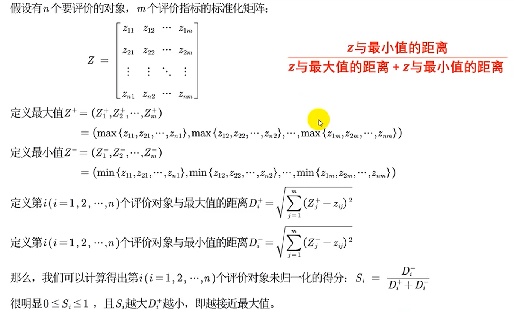

# 美赛

- 我主要看算法和编程部分
- 基本算法都得掌握，和qyb商量

- 期末后能完整做一次模拟题
- 快去学python
- 2.比赛时间： 北京时间2023年2月17日6：00（星期五）至2023年2月21日9：00（星期二）

  3.提交截止日期：北京时间2023年2月21日，上午10：00（星期二）

  4.比赛结果：结果将于2023年5月30日或之前发布。

- [x] 做一下聚类

## 论文

- 复现论文思路
- 只用文字解决问题可接受
- 重要的是模型的可行性分析

## 建模步骤

- 模型准备
- 模型假设
- 模型建立
- 模型求解
- 模型分析
- 模型检验
- 模型应用

1. 问题的分析

2.模型的建立

### 选题

不行就行C题吧

### 数据预处理

## 算法

### 规划类

#### 线性规划

- 优化类问题：有限的资源，最大的收益
- 模型

- 进行合理的模型简化

#### 蒙特卡罗法

- 当无法求得精确解时，进行随机抽样，根据统计试验求近似解
- 不断抽样，逐渐逼近
- 求定积分：
  - 随机投点法
  - 平均值法

- 采样方法：
  - 概率分布采样
  - 接受拒绝采样

#### 非线性规划

#### **整数规划**

- 现在基本上只解决整数线性规划
- (1)变量全限制为整数时，称纯（完全）整数规划
- (2)变量部分限制为整数时，称混合整数规划。
- 求解：
  - 使用intlinprog函数(需要转化为一维的决策变量)
  - 也可以使用Lingo

#### **0-1规划**

- 变量近取值0或1
- 适用于
  - 互相排斥的约束条件
  - 固定费用的问题
  - 指派问题

#### **多目标规划**

帕累托最优：

优先因子大，偏差变量要更小总体才会更小，体现出重要性

- 求解方法：fgoalattain函数

#### **粒子群算法**

- vij受惯性，个体最优，全局最优的影响
  - 前期应该乱飞，后期收敛
- 流程
  - 

### 预测类

#### **微分方程预测**

S：易感者 I：感染者 E：潜伏者 R：恢复者

- SI 艾滋模型

求解：ODE45

Logistic方程

- SIS 普通流感模型
- SIR
- [(31条消息) ODE45——求解状态变量（微分方程组）_Y. F. Zhang的博客-CSDN博客_ode45解方程组](https://blog.csdn.net/weixin_43145941/article/details/104783092)

#### **灰色预测**

#### **Markov预测**

- 未来只于现在有关
- 
- 马尔科夫链
  - 专治离散整数集的马尔可夫过程

- 时齐性
  - 系统由状态i转到状态j的转移概率只依赖于时间间隔的长短，与起始的时刻无关

#### **差分方程**

#### **时间序列**

#### **插值与拟合**

#### **神经网络**

### 评价决策类

- 目标
- 可选方案
- 准则

#### 层次分析法

- 引理：n阶正互反矩阵A为一致矩阵时当且仅当最大特征值入max=n.
  且当正互反矩阵A非一致时，一定满足入max>n.

- 求权重
  - 算术平均法
  - 几何平均法
  - 特征值法

步骤：

1. 建立系统的阶梯层次结构
   - 目标层-准则层-方案层
2. 构造判断矩阵
   - 目标层-准则层
   - 准则层-方案层
   - 根据资料填写
3. 由判断矩阵计算被比较元素对于该准则的相对权重并进行一致性检验（检验通过权重才能用）
4. 计算各层元素对系统目标的合成权重，并进行排序
   - 

局限性：

#### TOPSIS法

- 通过数据进行评价而非主观判断

- 

- 指标正向化：将所有指标转化为极大型

- 标准化处理

- 

- 步骤：

  1. 原始矩阵正向化

     1. 极小转极大max-x

     2. 
        $$
        M=\max \left\{\left|x_i-x_{\text {best }}\right|\right\}, \quad \tilde{x}_i=1-\frac{\left|x_i-x_{\text {best }}\right|}{M}
        $$

     3. 

  2. 矩阵标准化

     1. 

  3. 计算得分并归一化

### 数据处理

#### 插值法

~~~matlab
%分段三次埃尔米特插值
x = ‐pi:pi; y = sin(x);
new_x = ‐pi:0.1:pi;
p = pchip(x,y,new_x);
plot(x, y, 'o', new_x, p, 'r‐')
~~~

- 最近邻算法插值（一）
- 拉格朗日插值算法（一）
- 双线性内插算法（二）
- 分段线性插值（二）
- 三次样条插值（二）

matlab实现：

- interp1

- interp2

#### 拟合

- 直线拟合

- 曲线拟合

  - 线性最小二乘法

    

    matlab求解

    

### **多元分析**

#### **聚类分析**

#### **主成分分析**

#### **因子分析**

 
