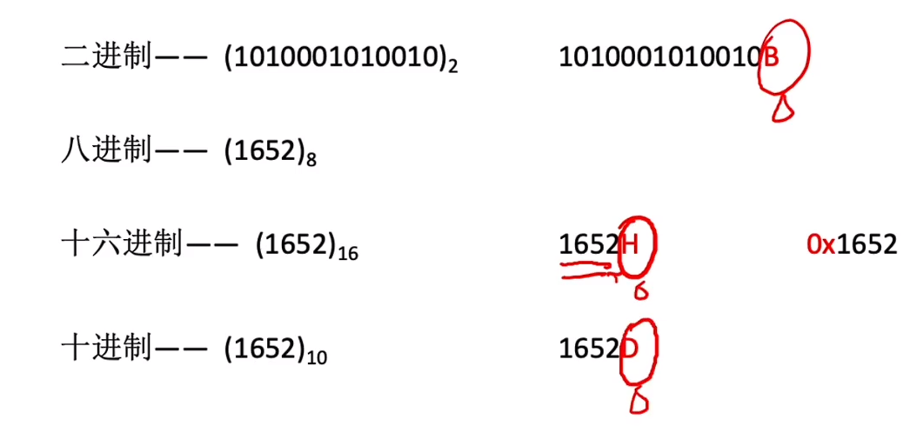

# 计算机组成原理

## 1.1_计算机的发展

## 1.2_1计算机硬件的基本组成

 冯诺依曼机

现代计算机结构

## 1.2_2各个硬件的工作原理

主存储器

运算器

控制器

## 1.2_3计算机系统的多级层次结构

## 1.3计算机的性能指标

存储器的性能指标 

CPU的性能指标

系统整体的性能指标

## 2.1_1进位计数制

## 2.1_2BCD码

BCD码的加法运算

余3码为无权码

## 2.1_3无符号整数的表示和运算

无符号整数的减法操作

## 2.1_4带符号整数的表示和运算

原码符号位不能参与加减运算

快捷方法

补码可以符号位参与运算，直接进位。补码数值位不能解读为位权

## 2.1_5原反补码的特性对比

==特别注意补码！！！==

## 2.1_6移码

方便硬件电路对比大小

## 2.1_7定点小数

定点小数不能用移码表示

 

位数扩展时，向后扩展

补码运算与整数相同