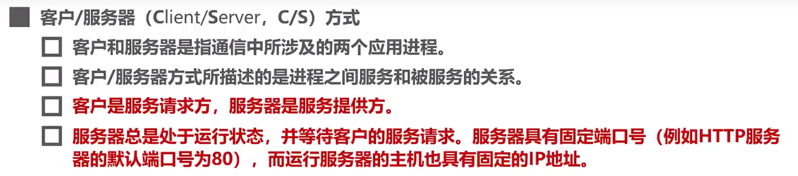

# 计算机网络

### Internet

- 节点
  - 主机
  - 路由器，交换机等交换设备
- 边  通信链路
  - access接入网：主机到互联网
  - backbone主干链路：路由器间
- 协议
  - 对等层的实体在通信过程中需要遵守的规则
  - 包括格式（语法语义），次序和动作

- 互联网是分布式的应用进程及为其提供通信服务的基础设施
  - 应用层以下都属于基础设施
  - TCP：面向连接的服务
  - UDP：无连接的服务

### 性能指标

比特：1B=8 bit,KB=2^10B,MB=2^20B  

- 在硬盘中的 GB=10^9B766677 

速率：bps,   kb/s=10^3 b/s    Mb/s=10^6b/s

带宽：信号的频率范围

- 单位与速率相同
- 频带宽度越宽，最高数据率越大

吞吐量

- 单位时间内通过的数据量

时延

- 发送时延
- 传播时延
  - ·铜线2.3*10^8 m/s
  - 光纤2*10^8 m/s
- 处理时延 
  - 包含了排队时延
- 
- 

时延带宽积：传播时延*带宽

- 以比特为单位的链路长度

往返时间RTT

利用率

- 信道利用率：有数据通过的时间占比
- 网络利用率：全网络的信道利用率的平均加权
- 利用率越高时，时延迅速增加
- D是当前时延 ，D0是空闲时的时延，U是利用率
- 
- 丢包率：丢失的分组数量的占比
  - 丢失一般是因为出现误码或网络拥塞而被丢弃

### 网络结构 

#### 网络边缘

- 主机，应用程序
- C/S模式   客户/服务器
- p2p模式   点对点
- 采用TCP服务
  - 需要先建立连接
  - 用于可靠性要求高的应用
  - 可靠，按顺序传输文件
    - 确认和重传
  - 流量控制
    - 发送方不会淹没接收方
  - 拥塞控制
    - 网络拥塞时，发送方降低发送速率（防止丢包
- UDP
  - 无连接
  - 不可靠数据传输
  - 无流量控制
  - 无拥塞控制
  - 用于实时多媒体应用

#### 网络核心

- 路由器，网络的网络
- 电路交换
- 分组交换
  - 使用全部的带宽
  - 分为一个个packet
  - 存储转发

- 带宽分成片
  - 频分FDM
  - 时分TDM
  - 波分WDM吧 

- 排队和延迟
  - 缓存用完了分组会被抛弃

#### 接入网和物理媒体

- 有线或无线通信链路

### 网络体系结构

- OSI体系结构
  - 应用层：应用进程之间的交互
  - 表示层：解决通信双方交换信息的表示问题
    - 主要包括字符集的转换，数据格式化，文本压缩，数据加密和解密等
  - 会话层：解决进程之间的会话问题
  - 运输层：解决进程之间基于网络的通信问题
  - 网络层：解决分组在多个网络之间传输（路由）
  - 数据链路层：解决分组在一个网络上传输（交换机
  - 物理层：解决使用何种信号传输（集线器

- TCP/IP体系结构

1. 网络接口层

   - PPP协议

   1. 物理层

      - 物理层为数据链路层屏蔽了各种传输媒体的差异，使其只需考虑完成本层的协议与服务，而不必考虑网络中具体的传输媒体是什么

      - 数据包：比特流

      - 导引型传输媒体：，光纤

        - 同轴电缆

          - 基带同轴电缆（50欧：数字传输，过去用于局域网
          - 宽带同轴电缆（75欧：模拟传输，主要用于有线电视

        - 双绞线

          - 绞合
            - 抵御部分来自外界的电磁波干扰
            - 减少相邻导线的电磁干扰

          - 无屏蔽双绞线UTP
          - 屏蔽双绞线STP

      - 非导引型传输媒体：微波信号

      - 协议的主要任务

        - 机械特性：接口形状
        - 电气特性：电压的范围
        - 功能特性：电压表示何种意义
        - 过程特性：时间的出现顺序

   2. 数据链路层
      - 服务访问方点为帧的‘类型“字段
      - 数据包：帧

2. 网际层
   - IP
     - 直接为ICMP提供服务
   - 服务访问点为IP数据报首部的”协议字段“
   - 数据包：IP数据包或分组
   - 提供无连接不可靠的数据报服务

3.  运输层
   - TCP
     - 数据包：TCP报文段
     - 服务于SMTP　FTP　BGP　HTTP
   - UDP
     - UDP用户数据报
     - 服务于RIP DNS　TFTP　SNMP　DHCP
   - 服务访问点为端口号
   - 应用程序到应用程序
   
4. 应用层
   - HTTP,DMTP,DNS,RTP
   - 数据包：应用报文

实体：任何可发送或接受信息的硬件或软件进程

协议

- 语法  定义格式
- 语义：定义所要完成的操作
- 同步：定义双方的时序关系
  - 建立连接

服务：为上一层提供服务

- 要使用本层协议需要使用下一层所提供的服务
- 下层的协议对上层不可见

服务访问点：相邻两层的实体交换信息的逻辑接口

服务原语：上层使用服务时所交换的一些命令

PDU：协议数据单元

- 对等层之间传送的数据包

SDU：服务数据单元

-  同一系统内层与层之间交换的数据包 

## 物理层

### 传输方式

串行传输：计算机之间

并行传输：计算机内部

同步传输

- 外同步：添加时钟信号线
- 内同步：将时钟同步信号编码到发送数据中（曼切斯特码

异步传输

- 字节之间异步
- 字节内的比特同步

单工

半双工：双向交替通信

双工：双向同时通信

### 编码与调制

消息->数据->信号发出的原始电信号为 

基带信号

- 数字基带信号（计算机内部
  - 编码用于数字信道（以太网
  - 调制用于模拟信道（WiFi

- 模拟基带信号（麦克风收集的声波信号
  - 编码：PCM
  - 调制：FDM

编码：在数字信道中传输

调制：在模拟信道中传输

码元：代表不同离散数值的基本波形

常用编码

曼切斯特编码：码元中间时刻的跳变即表示时钟，又表示数据

正交振幅调制QAM：同时调制相位和振幅，以使得一个码元能包含多个比特信息

QAM-16

- 16种码元，则每个码元可以表示4个比特， 2^4

- 使用格雷码，相邻码元只有一个比特不同

### 信道的极限容量

失真：码间串扰

奈氏准则：理想低通信道的最高码元传输速率=2W（默认是低（波特率

带通=W

- **低通信道** 就是信号的频率只要不超过某个上限值，都可以不失真地通过信道（有上限，无下限），理想**低通信道**的最高码元传输速率是每秒2个码元； 带通信道 既有上限也有下限，理想带通信道的最高码元传输速率是每秒1个码元。
- 调制速度即码元传输速度

信噪比：信号的平均功率与

香农公式：

## 数据链路层

### 3.2 封装成帧

- 为协议数据单元添加帧头和帧尾
  - 用于帧定界

- 透明传输

  - 对上层交付的传输数据没有限制
  - 面向字节的物理链路用字节填充来实现（插入转义字符
  - 

  - 

  - 面向比特的物理链路使用比特填充（每5个连续1后面加一个0

  - 

- 应使帧的数据部分的长度尽量大
- 最大传送单元MTU

### 3.3 差错检测

- 误码率BER：传输错误的比特占总数的比率
- 使用差错检测码检测是否产生了差错

- 奇偶校验

  - 

  - 如果有奇数个位发生误码，则能检测
  - 如果有偶数个位，则会漏检      

- 循环冗余校验CRC（漏检率非常低

- 

  - 只能检查错误，无法纠正错误

  - 亦或运算

    - 1 是[位运算](https://so.csdn.net/so/search?q=位运算&spm=1001.2101.3001.7020)

      ​    2 相当于 无进位相加 就是[二进制](https://so.csdn.net/so/search?q=二进制&spm=1001.2101.3001.7020)相加不进位

      ​     0101 ^ 0101 = 0000

      ​     0101 ^ 0000= 0101

- 要想前向纠错可以用海明码

###  3.4可靠传输

- 传输差错还包括分组丢失，分组失序，分组重复

- 
- 可靠传输服务不仅局限于数据链路层
- - 建立连接的三次握手
  - 

#### 停止-等待协议SW

- 超时重传

信道利用率

- 一般称为自动请求重传ARQ

#### 回退N帧协议GBN

累加确认ACKn

- 是一种连续ARQ协议

- 又称为滑动窗口协议

#### 选择重传协议SR

### 3.5PPP协议

- 不提供可靠的传输服务

### 3.6媒体接入控制

#### 静态划分信道CDMA

- 物理层

- 频分复用FDM
  - 

- 时分复用TDM
  - 

- 波分复用WDM
  - 

- 码分复用CDM
  - 

 

#### 载波监听多址接入/碰撞检测CSMA/CD

- 最小帧长64字节

T0表示帧的发送三时延

#### 载波监听多址接入/碰撞避免CSMA/CA

- 帧间间隔

- 退避算法

- 信道预约

### 3.7MAC地址，IP地址，ARP协议

#### MAC地址

媒体接入控制

- 也被称为硬件地址和物理地址
- 

#### IP地址

- mac地址只能是相邻的mac地址，ip地址保持不变

#### ARP协议

​    

 

 

- 逐段链路进行

### 3.8集线器与交换机

 

 

### 以太网交换机自学习

- 先登记再转发

### 以太网交换机得生成树协议STP

### 虚拟局域网VLAN

- IEEE 802.1Q帧
- 

- 交换机的端口类型
  - Access
    - 
  - Trunk
    - 
  - Hybrid
    - 

## 网络层

- 主要实现网络互联，实现数据包在各网络之间的传输

### IPv4

二进制转十进制

十进制转二进制

#### 分类编址的IPv4地址

- A类
  - 

B类

C类

#### 划分子网的IPv4地址

#### 无分类编制的IPv4地址

- 路由聚合
- 

#### IPv4地址的应用规划

- 定长的子网掩码FLSM
  - 
- 变长的子网掩码VLSM
  - 
  - 
  - 

#### IP数据报的发送和转发过程

- 源主机如何知道目的主机是否与自己在同一个网络 
  - 
- 
- 
- 路由器不转发广播数据报
  - 
  - 
  - 

#### 静态路由配置

- 静态路由配置
  - 
  - 
- 路由环路问题
  - 
- 聚合网络
  - 
  - 
  - 可以通过黑洞路由来解决问题
  - 
- 

### 路由选择协议

#### RIP的基本工作原理

RIP认为好的路由是所通过的路由器数量最少的路由

工作过程

 

#### 开放最短路径优先OSPF的基本工作原理

 

==基于Dijkstra算法==

 

#### 边界网关协议BGP的基本工作原理

 

###  IPv4数据报的首部格式

版本必须相同为IPv4  

MTU是指总长度最大数据单元

==这题真的难==

### 国际控制报文协议ICMP

- ICMP应用举例
  - 
  - 
  - 

### 虚拟专用网VPN与网络地址转换NAT

#### VPN

#### NAT

## 运输层

运输层直接为应用进程讲得逻辑通信提供服务

### 运输层端口号，复用与分用

 

### UDP和TCP

UDP

- UDP是无连接的
- 支持单播，多播，广播

TCP是面向连接的

- 仅支持单播
- 面向连接的可靠传输服务

### TCP流量控制

==即使接收窗口为0 ，也要接收零窗口探测报文段、确认报文段、紧急数据报文段==

### TCP拥塞控制

 

慢开始：按指数型增长

拥塞避免

快重传：可以 使发送方尽早指导发生了个别报文段的丢失

快恢复

### TCP超时重传的选择

出现超时重传RTO取为原来的两倍

### TCP报文的首部格式

- 序号：TCP报文数据列的首个数据的序号（seq

- 确认号：

序号是对自己的数据载荷的排序，确认号是对对方的数据的排序的确认

- 数据偏移

- 窗口

从接收窗口和拥塞窗口中取小者

### TCP运输连接管理

#### 三报文握手

对于普通TCP 数据报，不携带数据时不会占用序号

- 如果采用两报文握手

#### 四报文挥手

为了防止TCP服务器一直重传

## 应用层

### C/S和P2P

#### 客户/服务器方式C/S

  

### 动态主机配置协议DHCP

通过DHCP自动获取网络配置信息

- 使用UDP协议
  - DHCP服务器:UDP67
  -  DHCP客户 :UDP 68

DHCP中继代理

由于路由器会隔离广播域，因此可以为路由器配置DHCP服务器的IP地址并使之成为中继代理

- 从而可以不用在每一个网络上配置一个DHCP服务器

### 域名系统DNS

层次树状结构的域名结构

域名解析

高速缓存

- 采用UDP协议，端口号53

### 文件传送协议FTP

主动模式 

### 电子邮件

SMTP协议

### 万维网www

统一资源定位符URL

超文本传输协议HTTP

- HTTP响应报文

- Cookie

使用Cookie在服务器上记录用户信息

 

- 万维网缓存与代理服务器

题目

## 经典例题

